# 第 12 章：CI/CD 流水线自动化（基于云效 Flow）

> **本章目标**：把第 11 章手工做的"本地打包 → 上传 jar → 启动进程"全部自动化——你只管 `git push`，云效流水线自动构建并部署到 3 条路径中的任意一条（ECS / EDAS / SAE），前端同样自动发布。
>
> **本章特色**：**6 条流水线全景图**——3 个后端微服务 × 3 条上云路径 + 1 条前端流水线，对应第 11 章每一个手工步骤。

> ⭐ **这是本课程推荐的"正式"构建发布方式。** 第 11 章手敲的 `mvn deploy/package`、scp 上传、`manage.sh restart` 等命令，都是为了让你**理解原理**；真正日常迭代请用本章的流水线——`git push` 之后在网页上点几下，构建和发布全自动，**不用再手敲任何命令**。这与本课程"能点鼠标就不敲键盘"的主线一致。**后端推荐用路径 B（EDAS）流水线作默认**；路径 A 流水线属于进阶（对应第 11 章进阶的 ECS 手工部署）。

| 流水线 | 触发分支 | 构建什么 | 部署到哪 | 在哪一节 |
|--------|---------|---------|----------|---------|
| **后端 × 路径 A** | `main` | 3 个微服务 jar | 主机部署到 3 台 ECS + manage.sh restart | Part 4 |
| **后端 × 路径 B** | `main` | 3 个微服务 jar | EDAS 应用发布 | Part 5 |
| **后端 × 路径 C** | `main` | 3 个微服务 jar | Serverless(SAE)应用发布 | Part 6 |
| **前端（三路径共用）** | `main` | Vue dist | 主机部署到 ECS-3 + nginx -s reload | Part 7 |

---

## 📌 本章读法说明（务必先看）

云效 Flow 的界面**会随版本小幅调整**，按钮位置可能和本文截图不完全一样。**本章只承诺三件事**：

1. **菜单名和按钮文字** 是核对过官方文档的真名（如 **"Serverless(SAE)应用发布"** 而不是想当然的 "部署到 SAE"）
2. **操作动作** 用一句话写清楚要做什么
3. **截图位置** 用 `> 📷 截图：<描述>` 标出来，**学生跟着自己控制台截图对照即可**

> 凡是看到 `📷 截图占位` 的地方，下面紧跟一条 **🔗 官方文档参考链接**——点过去能在阿里云官方页面看到该步骤的真实截图。教学时建议老师自己控制台截一张本地版替换占位（更贴近学生实际看到的）。**不要相信任何带着多级菜单"顶部 X → 然后点 Y → 再点 Z"的描述**——UI 改版立刻失效，请以官方链接里的截图为准。

### 🎯 初学者第一遍这样走（只建一条流水线）

本章内容覆盖 3 条路径 × 多条流水线，**第一遍不要全做**，按这条最短路线走，目标是"一条流水线跑绿"：

```
Part 1（5 个名词，10 分钟）
  → Part 2（准备：代码进 Codeup + 存好凭据）
  → Part 3（构建：选模板 → 配源 → mvn 打包 → 构建物上传）
  → Part 5（部署：换上"EDAS 应用发布"任务）
  → git push 一次，看流水线全绿、EDAS 出新版本 🎉
```

- **Part 4（部署到 ECS 主机）/ Part 6（部署到 SAE）**：只有走对应路径时才需要，第一遍跳过
- **Part 7（前端流水线）**：后端跑通后再做，套路一样
- **Part 8 / 9（触发规则、灰度回滚）**：选读，知道有这回事即可

> 一句话记住本章：**构建是通用的，部署任务是可插拔的——换个部署任务，同一条流水线就能发到 ECS / EDAS / SAE。**

---

## 🧭 本章学习主线：手工一步步 ──► 流水线一步步替换

> 这是和第 11 章对称的展开方式。**CI/CD 不是"换一套工具"，而是"把第 11 章里每一个手工动作都让机器替你做"**。

| 第 11 章手工步骤 | 本章流水线对应步骤 | 在哪一节 |
|----------------|------------------|---------|
| 本地 `mvn deploy` 把 3 个库推到云效仓库 | **流水线"Java 构建上传"任务里跑 mvn deploy** | Part 3.3 |
| 本地 `mvn package` 打 3 个微服务 jar | **"Java 构建上传"任务自动跑** | Part 3.4 |
| 浏览器在 ECS 实例详情页"上传/下载文件"传 jar | **"主机部署"任务自动 scp** | Part 4 |
| 终端粘 `cd ~/coffee && ./manage.sh restart` | **"主机部署"的"部署脚本"框自动跑** | Part 4 |
| EDAS 控制台点 "部署应用" 上传新 jar | **"EDAS 应用发布"任务自动调 API** | Part 5 |
| SAE 控制台点 "部署应用" 上传新 jar | **"Serverless(SAE)应用发布"任务自动调 API** | Part 6 |
| 本地 `npm run build` + 上传 dist | **"Node.js 构建上传" + "主机部署"** | Part 7 |

---

## 目录

- [Part 1 云效 Flow 必懂的 5 个概念](#part-1-云效-flow-必懂的-5-个概念)
- [Part 2 准备工作：代码托管 + 全局设置](#part-2-准备工作代码托管--全局设置)
- [Part 3 通用构建配置（3 条路径共用）](#part-3-通用构建配置3-条路径共用)
- [Part 4 路径 A 流水线 — 后端构建 + 主机部署到 ECS](#part-4-路径-a-流水线--后端构建--主机部署到-ecs)
- [Part 5 路径 B 流水线 — 后端构建 + EDAS 应用发布](#part-5-路径-b-流水线--后端构建--edas-应用发布)
- [Part 6 路径 C 流水线 — 后端构建 + SAE 应用发布](#part-6-路径-c-流水线--后端构建--sae-应用发布)
- [Part 7 前端流水线 — Vue 构建 + 发布](#part-7-前端流水线--vue-构建--发布)
- [Part 8 触发规则与分支策略](#part-8-触发规则与分支策略)
- [Part 9 高级特性：审批 / 灰度 / 回滚](#part-9-高级特性审批--灰度--回滚)
- [附录 A：6 条流水线一览表](#附录-a6-条流水线一览表)
- [附录 B：常见问题排查](#附录-b常见问题排查)

---

## Part 1 云效 Flow 必懂的 5 个概念

> 这一节零操作，**先把名词搞清楚再去点鼠标**，否则面对云效控制台会一头雾水。

### 1.1 流水线（Pipeline）

一条流水线 = 一条"从代码到运行实例"的传送带。**本课程的命名约定**：

```
coffee-userorder-pipeline-A    （路径 A 后端·订单服务）
coffee-userorder-pipeline-B    （路径 B 后端·订单服务）
coffee-userorder-pipeline-C    （路径 C 后端·订单服务）
coffee-expresstrack-pipeline-A / B / C
coffee-app-pipeline-A / B / C
coffee-front-pipeline           （前端，A/B/C 三路径共用一条）
```

> 教学演示挑一条路径建 3 条后端 + 1 条前端就够。这里列全是让你看清"流水线 = 微服务 × 路径"的组合维度。

### 1.2 阶段（Stage）→ 任务（Task）→ 步骤（Step）

云效 Flow 把一条流水线拆成三层：

```
流水线
 └─ 阶段（顺序执行的一组任务）
     └─ 任务（如"Java 构建上传"、"主机部署"）
         └─ 步骤（任务内部更小的可编排单元）
```

学生只需在编辑页 **拖出"阶段"卡片 → 在卡片里加"任务"**。步骤多数情况下用任务的默认即可。

### 1.3 流水线源（Source）

流水线第一件事是去拉代码。云效支持：

- **云效 Codeup**（阿里云自家 Git，国内速度最快，本课程推荐）
- **GitHub**（绑账号后能拉，海外节点偶尔抽风）
- **Gitee / 自建 GitLab**

#### 流水线源 = 流水线和某个 Git 仓库的"绑定"——push 到哪个源就触发哪条流水线

新手最容易卡在这里：**"流水线源"不是随便填一个地址，而是把这条流水线和你某个具体 Git 仓库绑定起来**。绑定后，触发器会盯着这个仓库的 `main` 分支——**你 `git push` 到哪个仓库，就触发以那个仓库为流水线源的流水线**，push 到别的地方不会触发。

```
本地仓库
  ├─ git push codeup main ─► Codeup 仓库 ──触发──► 流水线源 = Codeup 的流水线
  └─ git push origin main ─► GitHub 仓库 ──触发──► 流水线源 = GitHub 的流水线
```

本课程主要用下面两条，**二选一即可**：

**路径①·用 Codeup 源（推荐）**

2.1 节已经用 `git remote add codeup ...` 把云效仓库加成一个远程。流水线源选 **Codeup → 仓库 `cloudnativeapp` → 分支 `main` → 勾 Push 触发**（具体在 3.3 节配）。以后只要 `git push codeup main`，流水线就自动开跑。云效拉代码走内网，最快最稳。

   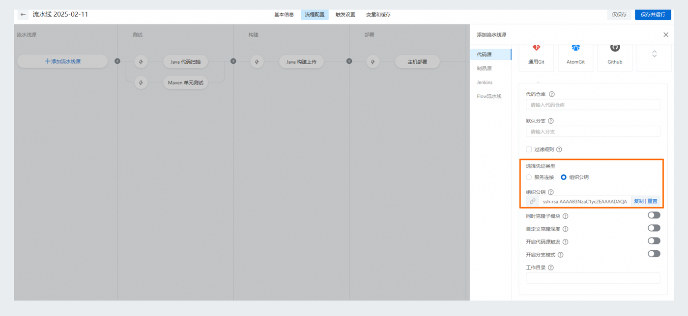
   > △ 流水线源配置面板：**源类型** 选 Codeup 后，**代码仓库** 下拉选 `cloudnativeapp`、**默认分支** `main`、勾 **Push 触发**。以后 `git push codeup main` 即触发本流水线。
   > 🔗 官方文档：[配置流水线源](https://help.aliyun.com/zh/yunxiao/user-guide/configure-pipeline-source)

**路径②·用 GitHub 源（怎么绑定）**

如果你想直接拿 GitHub 仓库当源、`git push origin main` 就触发，需要先让云效"认识"你的 GitHub 账号：

1. 新建或编辑流水线 → 点最左侧 **流水线源** 卡片 → **源类型** 选 **GitHub**

   > 📷 截图占位：流水线源面板「源类型」下拉展开、选中 GitHub（未授权时这一行会显示"去授权/添加授权"）
   > 🔗 官方文档：[配置流水线源（含第三方代码源绑定）](https://help.aliyun.com/zh/yunxiao/user-guide/configure-pipeline-source)

2. 首次选 GitHub 会提示**还没有 GitHub 代码源授权** → 点 **去授权 / 添加授权** → 跳转 GitHub 登录页，点绿色 **Authorize** 授权云效访问你的仓库（这一步云效会在 GitHub 仓库上注册一个 **webhook**，push 时由它通知云效）

   > 📷 截图占位：跳转到 GitHub 的 OAuth 授权页，点绿色 **Authorize** 按钮授权云效
   > 🔗 官方文档：[配置流水线源（含第三方代码源绑定）](https://help.aliyun.com/zh/yunxiao/user-guide/configure-pipeline-source)

3. 授权成功跳回云效 → **代码仓库** 下拉里选到 `<你的 GitHub 用户名>/cloudnativeapp` → **默认分支** 填 `main` → 勾 **Push 触发** → 保存

   
   > △ 授权成功后回到流水线源面板：**代码仓库** 选 `<你的 GitHub 用户名>/cloudnativeapp`、**默认分支** `main`、勾 **Push 触发**（面板布局与 Codeup 源一致，只是仓库来源换成 GitHub）。
   > 🔗 官方文档：[配置流水线源](https://help.aliyun.com/zh/yunxiao/user-guide/configure-pipeline-source)

4. 以后 `git push origin main`，GitHub 通过 webhook 通知云效，这条流水线自动开跑

> **镜像法的坑（别踩）**：也有人把 GitHub 当 source of truth、用 Codeup 仓库设置里的"代码同步"镜像过去。这种做法 **流水线源必须选你实际监听的那一侧**——选 Codeup 就只认 Codeup 收到的提交，而镜像同步有延迟、是否触发还取决于触发配置。教学场景**建议直接二选一（要么全走 Codeup，要么全走 GitHub），别两套混用**，否则会出现"我明明 push 了、流水线却没动"。

### 1.4 变量 / 服务连接

流水线里 **不要硬编码** 密码、密钥、私有仓库账号。两个地方放：

- **流水线变量**：明文，每条流水线独立。位置在 **流水线编辑页 → "变量和缓存" Tab**。适合 ECS IP、命名空间名等"非秘密但每条流水线不同"的值
- **服务连接**：加密存储，**所有流水线共用**。位置在 **全局设置 → 服务连接**。RDS 密码、阿里云 AccessKey 都放这里

> ⚠️ "凭据管理"是旧版本的叫法，新版本统一叫 **服务连接**。两者功能相同。

### 1.5 触发器（Trigger）

什么时候自动跑流水线：

- **代码触发**：监听某个分支 push（最常用，本课程默认监听 `main`）
- **定时触发**：cron 表达式
- **手动触发**：流水线列表点 "▶ 运行" 按钮（适合 dev 分支）

设置位置：**流水线编辑页 → "触发设置" Tab**。

---

## Part 2 准备工作：代码托管 + 全局设置

> 这一节做 3 件事：① 把代码推到云效能拉到的地方；② 在 **全局设置** 里建好 **服务连接**；③ 给 RAM 子账号授必要权限。

### 2.1 把代码推到云效 Codeup

> 如果你已经把项目托管在 GitHub 且能用 GitHub 触发流水线，跳过这一步。

1. 登录 [云效 DevOps](https://devops.aliyun.com) → 左上角应用切换器进 **代码管理 Codeup**
2. **新建代码库** → 名称 `cloudnativeapp` → 创建

   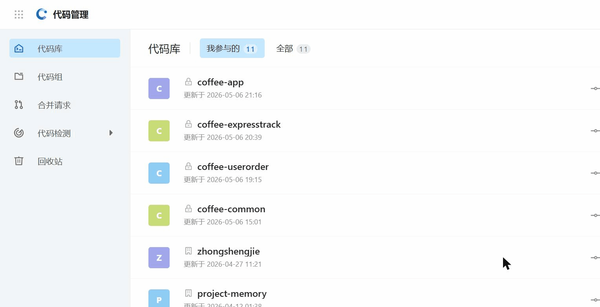
   > △ 云效 Codeup（[codeup.aliyun.com](https://codeup.aliyun.com)）代码管理页：左侧"代码库/代码组"，右上角 **新建代码库** / **导入代码库**。本课程的 coffee-app / coffee-userorder / coffee-expresstrack / coffee-common 仓库都在这里。
   > 🔗 官方文档：[创建代码库 - Codeup](https://help.aliyun.com/zh/yunxiao/user-guide/create-a-code-base)

3. 终端进项目根目录，把云效仓库当作另一个远程推上去：
   ```bash
   git remote add codeup https://codeup.aliyun.com/<你的命名空间>/cloudnativeapp.git
   git push codeup main
   ```

### 2.2 找到"全局设置"入口（很多人卡这里）

4. 回流水线 Flow 首页 → **左侧导航最下方** 有 **⚙ 全局设置**

   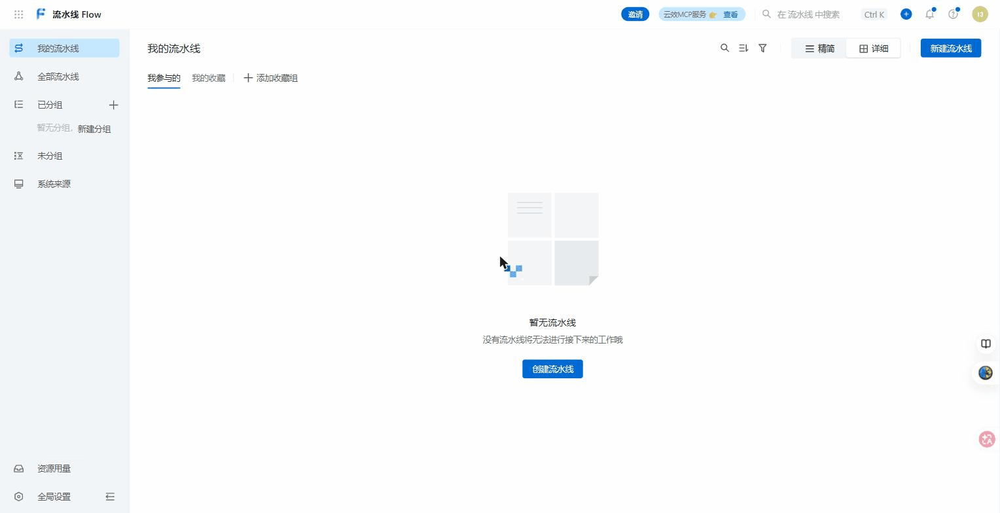
   > △ 云效 Flow（[flow.aliyun.com](https://flow.aliyun.com)）首页：**左侧导航最下方**就是 **⚙ 全局设置**（服务连接、主机组管理都在里面）；右上角蓝色 **新建流水线** 按钮见 3.1 节。
   > 🔗 官方文档：[服务连接 - 查看入口位置](https://help.aliyun.com/zh/yunxiao/user-guide/service-connection)

5. 进去后右侧会展开多个子项，本章会用到：
   - **服务连接**（加密凭据）
   - **主机组管理**（路径 A 用）
   - **通用变量组**（可选，多条流水线共享变量时用）

### 2.3 建 2 个服务连接

#### 服务连接 1：阿里云访问凭证（路径 B / C 部署用）

6. **全局设置 → 服务连接 → 新建服务连接**

   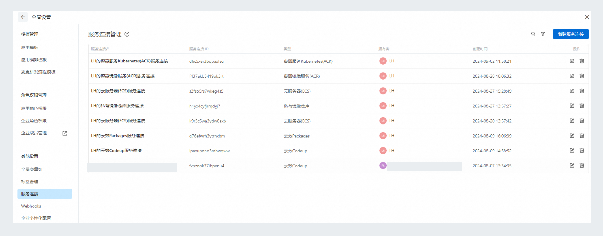
   > △ 官方文档截图：全局设置 → 服务连接管理，右上角"新建服务连接"
   > 🔗 官方文档：[服务连接](https://help.aliyun.com/zh/yunxiao/user-guide/service-connection)

7. 在弹窗里选 **阿里云**（类型）→ 下一步
8. 进 [RAM 控制台](https://ram.console.aliyun.com/users) 用 **子账号** 生成一对 AccessKey ID / Secret（**绝对不要用主账号**），把 AK/SK 填回云效弹窗
9. 名称起为 `aliyun-ak`，保存

#### 服务连接 2：私有 Maven 仓库账号（构建 mvn deploy 时用）

10. 再点 **新建服务连接** → 类型选 **私有 Maven 仓库**（或 "用户名密码"）
11. 用户名 / 密码就是你本地 `~/.m2/settings.xml` 里 `<server>` 节点的值
    - 找不到？回 06 章 Part 4.2 → 云效制品仓库 → 右上角"配置指引" → 复制凭据
12. 名称起为 `yunxiao-maven`，保存

### 2.4 给 RAM 子账号授必要权限

13. 还在 RAM 控制台 → 找到第 8 步那个子账号 → **权限管理 → 新增授权**
14. 系统策略里搜并勾选这 2 个：
    - `AliyunEDASFullAccess`（路径 B 用）
    - `AliyunSAEFullAccess`（路径 C 用）
15. 确定授权

> **为什么必须用子账号 AK**：主账号 AK 一旦泄露损失巨大，云效流水线日志是可下载的——任何把 AK 写在日志里的失误都会变成事故。**子账号 + 最小权限** 是任何 CI/CD 体系的硬铁律。

---

## Part 3 通用构建配置（3 条路径共用）

无论后面走 ECS、EDAS 还是 SAE，**构建阶段几乎一样**——都是 `mvn package` 打 jar。这一节先把构建配通，Part 4/5/6 只换"部署阶段"。

### 3.1 第一次创建流水线（这一节学了，4/5/6 直接复用）

16. 流水线 Flow 首页 → **右上角蓝色"新建流水线"按钮**

    
    > △ 云效 Flow 首页右上角的蓝色 **新建流水线** 按钮（同一页左下角是 2.2 节的"全局设置"）。中间区域无流水线时会显示"创建流水线"引导。
    > 🔗 官方文档：[创建流水线 - 入口与模板](https://help.aliyun.com/zh/yunxiao/user-guide/build-and-deploy-a-java-application-to-an-ecs-host)

17. 弹出 **选择流水线模板** 窗口 → 左侧分类点 **Java** → 选 **"Java · 测试、构建、部署到阿里云 ECS / 自有主机"**

    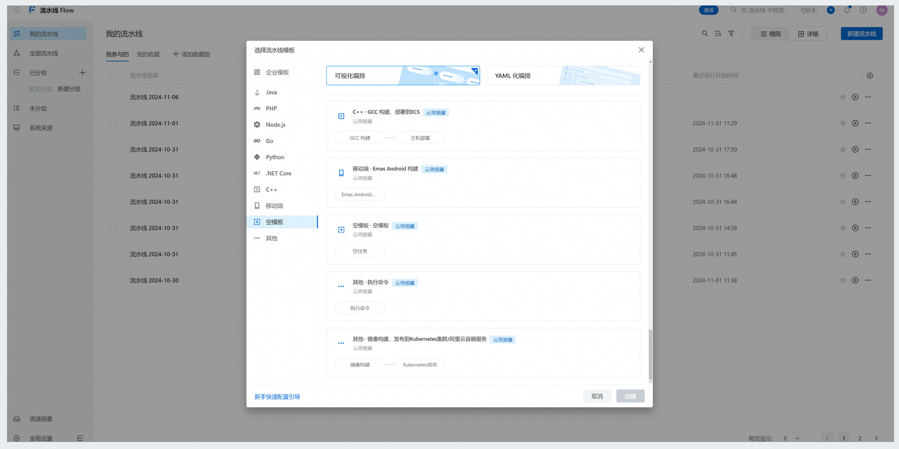
    > △ 官方文档截图：模板选择弹窗——左侧按语言分类，点 Java 后在右侧卡片里找模板
    > 🔗 官方文档：[模板选择 - Java 主机部署](https://help.aliyun.com/zh/yunxiao/user-guide/build-and-deploy-a-java-application-to-an-ecs-host)

    > **教学说明**：3 条路径都先用这个模板创建，进去后只是把"主机部署"那个任务删掉换成对应的 EDAS / SAE 任务。**所有 Java 流水线选这个模板做起点最省事**。

18. 起名 + 创建 → 进入 **流程配置** 页（流水线编辑页的主标签）

### 3.2 流程配置页的核心结构

进入流程配置页你会看到一张从左到右的流程图：

```
[流水线源] ──► [阶段 1：测试/构建] ──► [阶段 2：部署] ──► [...可以加更多阶段]
```

- 最左侧 **流水线源** 卡片：点它配置代码源
- 后面每个 **阶段** 卡片：点 **"+ 添加任务"** 加任务
- 阶段之间的 **"+"** 圈：点它在两个阶段之间加新阶段

   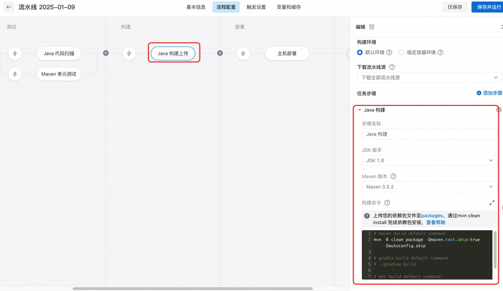
   > △ 官方文档截图：流程配置页全景——左侧测试/构建/部署三段，点中某任务（红框"Java 构建上传"）右侧弹出它的配置
   > 🔗 官方文档：[编排流水线的阶段任务与步骤](https://help.aliyun.com/zh/yunxiao/user-guide/process-configuration)

### 3.3 配置流水线源

19. 点最左侧 **流水线源** 卡片 → 右侧抽屉打开
20. **源类型** 选 **Codeup**（或 GitHub，跟你 2.1 的选择对应）。⚠️ **这里选的源，就是你 `git push` 时必须推到的那个仓库**；GitHub 源的账号授权绑定见 **1.3 节「路径②·用 GitHub 源」**
21. **代码仓库** 下拉选 `cloudnativeapp`
22. **默认分支** 填 `main`
23. **触发方式** 勾选 **Push 触发**（先勾，Part 8 再细调）
24. 保存

    
    > △ 官方文档截图：点最左侧"添加/流水线源"后右侧的代码源配置面板——选代码源类型、仓库、分支都在这里

### 3.4 配置"Java 构建上传"任务

25. 默认模板里第一个阶段已经有 **"Java 构建上传"** 任务，点它打开右侧配置
26. 关键字段：

    | 字段 | 教学项目填什么 |
    |------|--------------|
    | JDK 版本 | OpenJDK 17 |
    | Maven 版本 | 3.8 或 3.9 任选 |
    | 构建命令 | 见下方 |
    | 构建物路径 | `coffee-*/provider/target/*.jar`（应用模块视情况调整） |
    | 制品名称 | `app-jar`（部署任务靠这个名字找到产物） |

27. **构建命令** 模板（**替换 `<MODULE>` 三处之一**）：
    ```bash
    mvn -B clean package -DskipTests -pl <MODULE> -am \
        -s settings-yunxiao.xml \
        -Daliyun.repo.url=$ALIYUN_REPO_URL \
        -Daliyun.repo.snapshot.url=$ALIYUN_REPO_SNAPSHOT_URL
    ```

    | 微服务 | `<MODULE>` 填 |
    |--------|--------------|
    | coffee-userorder | `coffee-userorder/provider` |
    | coffee-expresstrack | `coffee-expresstrack/provider` |
    | coffee-app | `coffee-app` |

    > 🎯 **两个参数的人话版**：`-pl <模块>` = "只构建这一个模块"（复制流水线给另两个服务时，改的就是它）；`-am` = "顺带把它依赖的库（common / api）一起编译"——构建机是台全新机器，没有你电脑的 `~/.m2`，不带 `-am` 会报"找不到 artifact"。

28. 构建命令里用到的 `$ALIYUN_REPO_URL` 等变量在哪里设？回 **流水线编辑页顶部 "变量和缓存" Tab** → 加：
    - `ALIYUN_REPO_URL` = 你的云效制品仓库地址
    - `ALIYUN_REPO_SNAPSHOT_URL` = 同上的 snapshot 仓库地址

    > 📷 截图占位：流水线编辑页"变量和缓存" Tab 添加变量界面
    > 🔗 官方截图参考：[流水线变量和缓存](https://help.aliyun.com/zh/yunxiao/user-guide/manage-pipeline-variables-and-cache)

29. **使用凭据**：在 Java 构建上传任务里勾选 **使用服务连接**（或 "Maven 凭证"）→ 选 Part 2.3 第 12 步建的 `yunxiao-maven`

### 3.5 应用模块为什么要 `-am`，库模块需不需要先 deploy

项目有 3 个 **库模块**（`coffee-common`、`coffee-userorder/api`、`coffee-expresstrack/api`），应用要拉它们才能编译：

- **库代码没改时**：应用模块 `-pl <provider> -am` 会在构建机本地同包重新编译一次，能跑通，不需要先 deploy
- **库代码改了时**：要 **先把库 deploy 到云效仓库**，否则别人 / 别的流水线拉不到

**推荐做法**：再开一条 **专门的库发布流水线** `coffee-libs-pipeline`，监听 `coffee-common/**`、`coffee-*/api/**` 路径变化，构建命令：

```bash
mvn -B clean deploy -DskipTests -pl coffee-common,coffee-userorder/api,coffee-expresstrack/api \
    -s settings-yunxiao.xml
```

### 3.6 "构建物上传"——下一关键步骤

云效流水线 **每个步骤之间默认不共享文件**——jar 不显式上传就到不了部署任务。

30. 在 Java 构建上传任务里找到 **构建物上传** 区域 → 填：
    - **制品名称**：`app-jar`
    - **打包路径**：`coffee-*/provider/target/*-1.0-SNAPSHOT.jar`（coffee-app 填 `coffee-app/target/coffee-app-0.0.1-SNAPSHOT.jar`）

    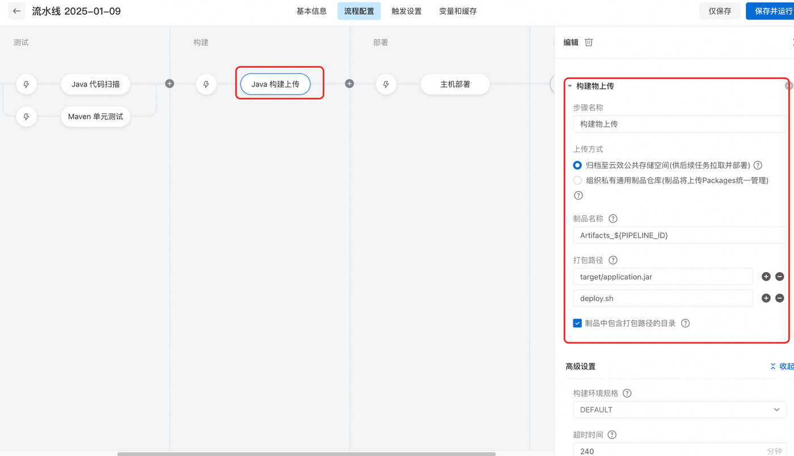
    > △ 官方文档截图："Java 构建上传"任务里的「构建物上传」步骤——制品名称、打包路径就填在红框这两栏
    > 🔗 官方文档：[配置 Java 构建任务 - 构建物上传步骤](https://help.aliyun.com/zh/yunxiao/user-guide/build-and-deploy-a-java-application-to-an-ecs-host)

31. 后面部署任务的 **制品/产物** 下拉里就能选到这个 `app-jar`

> 这里是 **CI/CD 新手最大坑** —— 构建明明绿，部署却报"找不到 jar"，几乎一定是 30 步没配。

---

## Part 4 路径 A 流水线 — 后端构建 + 主机部署到 ECS

> **对照 06 章 Part 5**：第 11 章你"实例详情页上传 jar → 会话管理终端粘 `./manage.sh restart`"那两步，本节让流水线自动做。

### 4.1 在"全局设置 → 主机组管理"建主机组

> ⚠️ 这一节有个 **重要前置**：主机组不是简单填密码，而要在每台 ECS 上 **装"流水线 Runner"**（云效官方 Agent）。下面一步步来。

32. 进 **全局设置 → 主机组管理** → **新建主机组**

    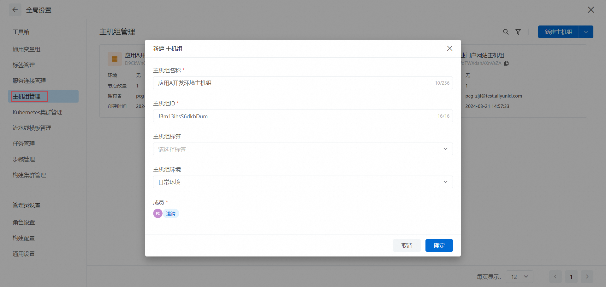
    > △ 官方文档截图：全局设置 → 主机组管理 → 新建主机组
    > 🔗 官方文档：[主机组管理](https://help.aliyun.com/zh/yunxiao/user-guide/host-group-management)

33. 填基础信息：
    - **主机组名称**：`coffee-prod-ecs`
    - **接入方式**：根据当前云效版本不同，可能显示为 **"阿里云 ECS"** 或 **"流水线 Runner"** —— 都选**支持自动安装 Runner 的那一项**

34. 进入主机列表 → **添加主机** → 用 **阿里云 ECS** 子菜单 → 勾选你的 ECS-1 / ECS-2 / ECS-3 → 云效会通过 **阿里云云助手**（不是 SSH）远程在 ECS 上装 Runner

    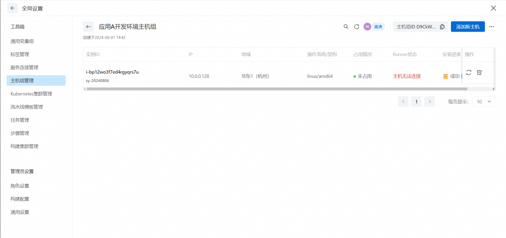
    > △ 官方文档截图：主机组详情——每台主机一行，右侧显示 Runner 安装/在线状态
    > 🔗 官方文档：[主机组管理 - 添加主机](https://help.aliyun.com/zh/yunxiao/user-guide/host-group-management)

35. 等约 1-2 分钟，3 台 ECS 状态变 **"在线"**

> **如果"在线"状态卡很久**：去 ECS 控制台确认每台 ECS 都装了 **云助手 Agent**（阿里云 ECS 默认就装了，少数自定义镜像可能没装）→ 再回云效页面刷新。

> **为什么不用密码而要装 Runner**：Runner 是云效的长连接客户端，部署时由 Runner 主动从云效拉 jar，**ECS 无需对外开 22 端口**——比 SSH 推送方式更安全。这是云效现在主推的方式。

### 4.2 创建 userorder 流水线（A 版）

36. 按 **Part 3.1** 流程新建流水线，名字叫 `coffee-userorder-pipeline-A`
37. 完成 Part 3.3 / 3.4 / 3.6 的代码源、构建、构建物上传配置（构建命令用 `-pl coffee-userorder/provider -am`）
38. 流程图里第二阶段 **默认就是"主机部署"任务**（用模板的好处），点开它配置：

    | 字段 | 填什么 |
    |------|--------|
    | **制品** | 选 `app-jar`（上游产物） |
    | **主机组** | 选 `coffee-prod-ecs` |
    | **过滤主机** / **标签** | 只选 ECS-1（按标签或 IP 过滤，看你主机组怎么打标） |
    | **下载路径** | `/root/coffee/jars/coffee-userorder-provider-1.0-SNAPSHOT.jar` |
    | **执行用户** | `root` |
    | **部署脚本** | 见下 |

    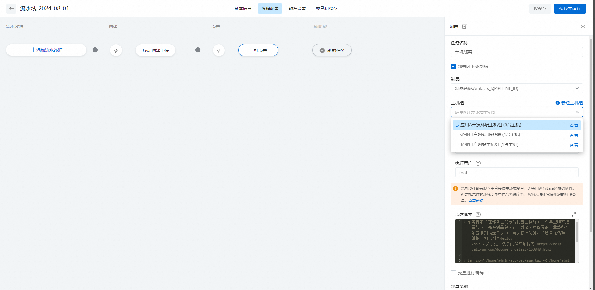
    > △ 官方文档截图：流水线编辑页右侧的"主机部署"任务配置（主机组、制品、部署脚本都在这里填）
    > 🔗 官方文档：[接入主机并配置流水线主机部署任务](https://help.aliyun.com/zh/yunxiao/user-guide/host-deployment-1)

39. **部署脚本** 框里粘：
    ```bash
    cd /root/coffee && ./manage.sh restart userorder
    ```
40. 保存 → 点 **运行** 测试一次 → 看每个任务变绿

    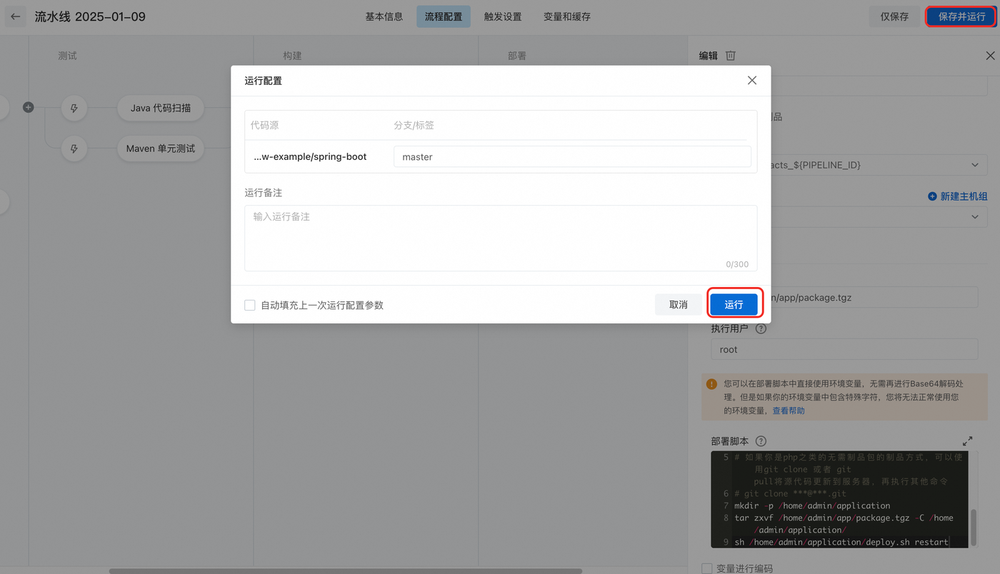
    > △ 官方文档截图：右上角"保存并运行"后的运行配置弹窗，确认分支后点"运行"

### 4.3 复制 expresstrack 和 coffee-app 流水线

41. 流水线列表对 `coffee-userorder-pipeline-A` 点 **⋯ → 复制**
42. 改 5 处：
    - 名称 → `coffee-expresstrack-pipeline-A`
    - 构建命令的 `-pl` 改成 `coffee-expresstrack/provider`
    - 构建物路径改成 `coffee-expresstrack/provider/target/*.jar`
    - 部署目标 ECS-1 → **改成 ECS-2**
    - 部署脚本 `restart userorder` → `restart expresstrack`
43. **再复制一次** 做 coffee-app 流水线，部署到 ECS-3，脚本 `restart app`，构建命令 `-pl coffee-app`

### 4.4 路径 A 流水线全链路演示

44. 在本地随便改一行 `coffee-userorder/provider/.../OrderServiceImpl.java`（比如改一句日志）
45. `git add . && git commit -m "test pipeline" && git push codeup main`
46. **看云效流水线列表**：`coffee-userorder-pipeline-A` 自动开跑 → 约 90 秒后绿色 ✅

    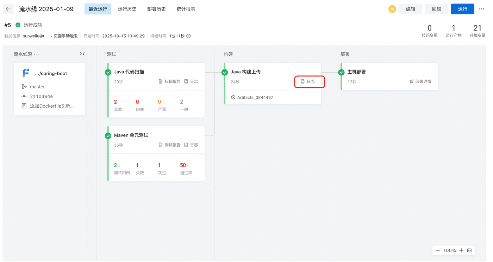
    > △ 官方文档截图：跑完应该长这样——测试、构建、部署每个任务卡片都打绿勾
47. 回 ECS-1 会话管理终端：`tail -50 ~/coffee/logs/userorder.log` → 应能看到刚改的那行日志

🎉 第一条 CI/CD 链路打通——从你按下 `git push` 到生产环境跑起新版本，**全程零手工**。

---

## Part 5 路径 B 流水线 — 后端构建 + EDAS 应用发布

**对照 06 章 Part 6**：你之前"EDAS 控制台 → 应用详情 → 部署应用 → 上传 jar"的 4 次点击，本节让流水线一次搞定。

### 5.1 准备：记下 EDAS 应用 ID

48. 浏览器进 EDAS 控制台 → 应用列表 → 点 `userorder` 进详情
49. 复制 **应用 ID**（详情顶部或 URL 里 `appId=xxx` 那一段）到记事本
50. 对 `expresstrack` 和 `coffee-app` 各做一次

### 5.2 创建 userorder 流水线（B 版）

51. **复用 Part 3.1** 的模板新建（仍选 Java 主机部署模板，进去后把"主机部署"那个任务换掉即可）
52. 流水线名 `coffee-userorder-pipeline-B`
53. 完成代码源、构建、构建物上传配置（构建命令、`app-jar` 都和 A 版一样）
54. **删掉默认的"主机部署"任务**，原位置点 **"+ 添加任务"** → 在任务列表里搜 **"EDAS"** → 选 **"EDAS 应用发布"**

    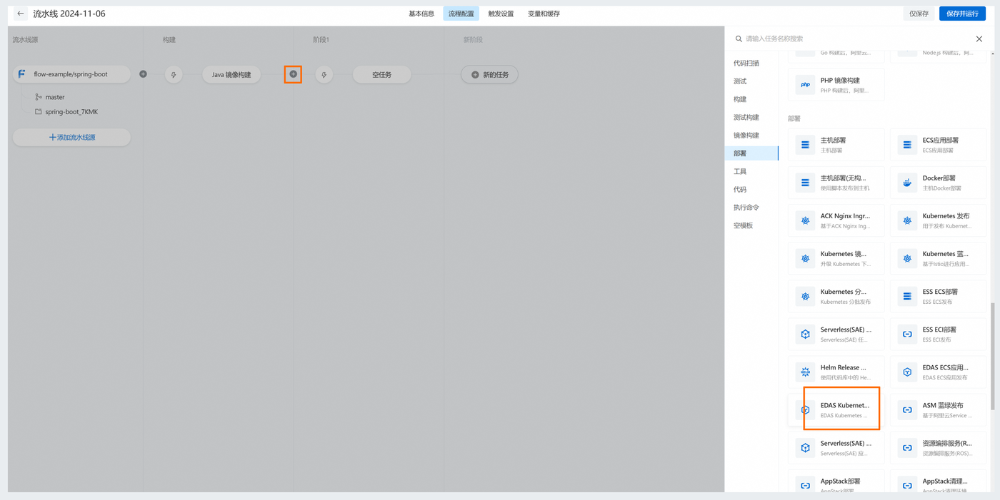
    > △ 官方文档截图：点阶段里的 "+" 后右侧弹出任务列表，左侧分类选"部署"或直接搜索（橙框处即 EDAS 发布任务）
    > 🔗 官方文档：[构建并部署 Java 应用到 EDAS](https://help.aliyun.com/zh/yunxiao/use-cases/build-and-deploy-edas-kubernetes-java-applications)

55. 配置 **EDAS 应用发布** 任务：

    | 字段 | 填什么 |
    |------|--------|
    | **服务连接 / 阿里云授权** | 选 Part 2.3 第 9 步建的 `aliyun-ak` |
    | **地域** | 和你 EDAS 同地域 |
    | **应用** | 下拉里找到 `userorder` |
    | **分组** | 默认（除非你在 EDAS 内分了灰度组） |
    | **部署包来源** | **构建产物** |
    | **构建产物** | 选 `app-jar` |
    | **JVM 参数 / 启动参数** | **留空**（用 EDAS 应用上已有的配置） |

    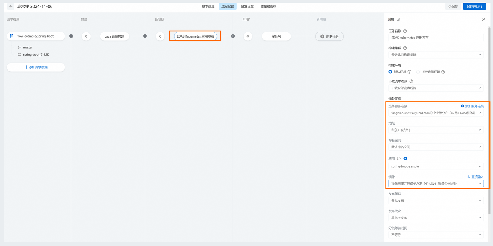
    > △ 官方文档截图：EDAS 发布任务的配置抽屉（截图为 K8s 集群版任务，ECS 集群版字段同类：服务连接、地域、应用、部署包）
    > 🔗 官方文档：[EDAS 应用发布任务配置](https://help.aliyun.com/zh/yunxiao/use-cases/build-and-deploy-edas-kubernetes-java-applications)

> **常见误区**：JVM 参数填进流水线后会 **覆盖** EDAS 应用的现有配置。留空让 EDAS 沿用 06 章 Part 6.4 填好的 `-DENV=prod -DDB_HOST=...`——这是配置管理的"单一来源"原则：**应用配置只在 EDAS 控制台维护，流水线只管推 jar**。

56. 保存 → 运行测试

### 5.3 复制另外 2 条 EDAS 流水线

57. 同 Part 4.3 复制改名 + 改构建命令的 `-pl` + 改 EDAS 任务里选的"应用"

---

## Part 6 路径 C 流水线 — 后端构建 + SAE 应用发布

**对照 06 章 Part 7**：SAE 控制台手工上传新版本 jar 的过程，本节让流水线自动做。

### 6.1 关键差异：SAE 没有"主机组"概念

路径 A 是把 jar 推到固定 ECS；路径 B 是 EDAS Agent 推到 ECS；**路径 C 是云效调 SAE OpenAPI 触发"滚动部署"**——SAE 自己弹实例、自己拉新 jar、自己重启。流水线只负责"打包 + 告诉 SAE 用这个新 jar"。

### 6.2 准备：记下 SAE 应用 ID 和命名空间

58. SAE 控制台 → 应用列表 → 点 `userorder-sae` 进详情
59. 复制 **应用 ID**（详情页顶部那一行）
60. 复制 **命名空间 ID**（左侧"命名空间"列表里那行的 ID 列，形如 `cn-hangzhou:coffee-prod-sae`）
61. 对另两个 SAE 应用各做一次

### 6.3 创建 userorder 流水线（C 版）

62. 同 Part 5.2 的方式新建 `coffee-userorder-pipeline-C`，构建部分共用
63. **删掉"主机部署"任务**，原位置 **+ 添加任务** → 搜 **"SAE"** → 选 **"Serverless(SAE)应用发布"**

    > 📷 添加任务抽屉和 Part 5 第 54 步那张截图是同一个界面（见上文配图），搜索框输 `SAE` 即可
    > 🔗 官方文档：[使用云效流水线构建 Java 应用并部署到 SAE](https://help.aliyun.com/zh/yunxiao/use-cases/java-application-build-and-deploy-sae)

64. 配置 **Serverless(SAE)应用发布** 任务：

    | 字段（按官方文档真实名） | 填什么 |
    |--------|--------|
    | **服务连接** | 选 `aliyun-ak` |
    | **地域** | 和 SAE 同地域 |
    | **命名空间** | 选 `coffee-prod-sae` |
    | **SAE 应用** | 下拉里选 `userorder-sae` |
    | **构建产物** | 选 `app-jar` |
    | **发布策略** | `分批发布` |
    | **发布批次** | `1`（教学环境） |
    | **分批批次间等待时间** | `0` 秒 |

    > 📷 截图占位：Serverless(SAE)应用发布任务配置面板
    > 🔗 官方截图参考：[Serverless(SAE)应用发布任务配置](https://help.aliyun.com/zh/yunxiao/user-guide/sae-application-release)

65. 保存运行

### 6.4 复制 expresstrack 和 coffee-app 流水线

66. 同 4.3 / 5.3 复制改名 + 改构建命令 + 改 SAE 应用

### 6.5 SAE 流水线的"冷启动注意"

> SAE 应用在**新部署/重启后**，实例要现拉镜像、启 JVM，流水线部署完毕后首次访问会等几秒（冷启动正常现象）。教学演示前最好手动 `curl` 一次预热。

---

## Part 7 前端流水线 — Vue 构建 + 发布

前端构建对三条路径完全一样，**发布也统一到 ECS-3 的 Nginx**——只有"前端把 API 发到哪个后端地址"随路径不同：

| 前端走哪 | 后端在 | 静态文件托管在 | `FRONT_API_URL` 填什么 |
|---------|-----|--------------|----------------------|
| **路径 A / B 配套** | ECS / EDAS | **ECS-3 的 Nginx** | `http://<ECS-3 公网 IP>:8005` |
| **路径 C 配套** | SAE | **ECS-3 的 Nginx**（同一条流水线） | SAE 公网 CLB 域名 |

> **为什么路径 C 也用 Nginx 而不用 OSS？** 走 SAE 时后端没有"跑 coffee-app 的 ECS-3"了，但前端只是几十个静态文件，**留一台最小规格 ECS 跑 Nginx 托管前端**即可——这样三条路径的前端发布**完全复用 06 章 Part 8 已经讲过的 Nginx 部署**，不必再引入 OSS Bucket、静态网站托管、静态页 404 兜底这一整套额外知识。教学上"前端只讲一次"，认知负担最低。

### 7.1 前端流水线（三路径共用，推到 ECS-3 Nginx）

67. **新建流水线** → 模板选 **"Node.js · 测试、构建、部署到阿里云 ECS / 自有主机"**

    
    > △ 官方文档截图：和后端建流水线是同一个模板弹窗，左侧语言分类切到 **Node.js** 再选主机部署模板
    > 🔗 官方文档：[Node.js 应用构建部署](https://help.aliyun.com/zh/yunxiao/user-guide/build-and-deploy-a-node-js-application-to-a-host)

68. 名字 `coffee-front-pipeline`
69. **流水线源** 同后端配
70. **Node.js 构建上传** 任务：

    | 字段 | 填什么 |
    |------|--------|
    | Node 版本 | 18.x |
    | 工作目录 | `app-admin` |
    | 构建命令 | 见下 |
    | 构建物路径 | `app-admin/dist/**` |
    | 制品名称 | `dist` |

71. **构建命令**：
    ```bash
    npm config set registry https://registry.npmmirror.com && \
    npm ci && \
    VUE_APP_BASE_URL=$FRONT_API_URL npm run build
    ```
72. **变量和缓存 Tab** 加 `FRONT_API_URL`，**值随后端路径不同**：
    - **路径 A / B**：`http://<ECS-3 公网 IP>:8005`（和 06 章 Part 8.1 是同一个值）
    - **路径 C（SAE）**：填 SAE 的 **公网 CLB 域名**（06 章 Part 7.7 创建的，无端口号，CLB 默认 80）

    > 三条路径**共用这一条前端流水线**，切换后端时只需把 `FRONT_API_URL` 改成对应地址，重跑一次即可——构建产物和"主机部署到 ECS-3"这两步完全不变。
73. **主机部署** 任务：
    - 主机组：`coffee-prod-ecs`，过滤 ECS-3
    - 下载路径：`/usr/share/nginx/html/dist.tar.gz`（或 `/usr/share/nginx/html/`，取决于云效对 dist 文件夹的打包方式）
    - 部署脚本：
      ```bash
      cd /usr/share/nginx/html && \
      [ -f dist.tar.gz ] && tar -xzf dist.tar.gz --strip-components=1 && rm dist.tar.gz; \
      nginx -t && nginx -s reload
      ```

    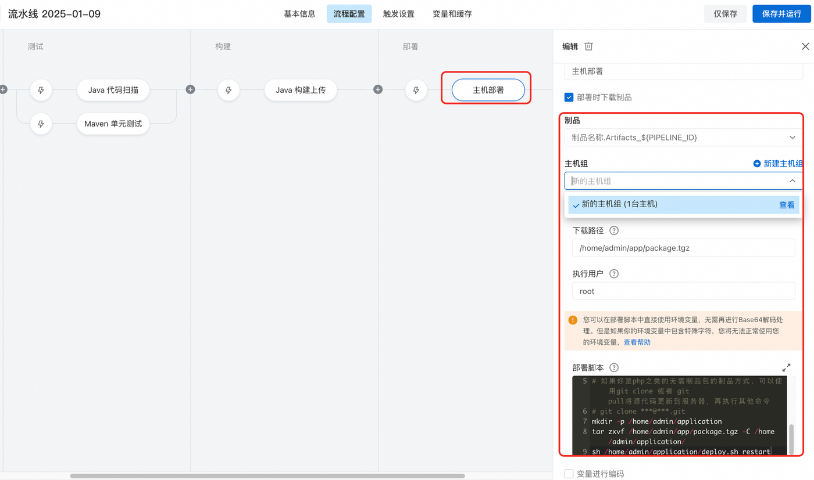
    > △ 官方文档截图：主机部署任务配置面板——制品下拉、主机组、下载路径、部署脚本从上到下依次填
    > 🔗 官方文档：[主机部署任务配置](https://help.aliyun.com/zh/yunxiao/user-guide/host-deployment-1)

    > **ECS-3 用宝塔镜像的同学注意**：宝塔的网站根目录不是 `/usr/share/nginx/html`，而是 **`/www/wwwroot/<你的站点名>`**（在宝塔「网站」列表里能看到该站点的根目录）。把上面下载路径和部署脚本里的 `/usr/share/nginx/html` 全部换成你的站点根目录即可；`nginx -s reload` 宝塔环境同样可用。手工部署（11 章 Part 8.3 方式①宝塔）时本来就在面板里点鼠标，不涉及这条路径。

74. 保存运行 → 浏览器访问 `http://<ECS-3 公网 IP>/` → 看到新版本前端

### 7.2 路径 C（SAE）的前端怎么发——还是这条流水线

走 SAE 路径时后端没有"跑 coffee-app 的 ECS-3"了，但前端是纯静态文件，**留一台最小规格 ECS 跑 Nginx 托管**即可，发布流程和 7.1 **一模一样**，不需要单独建第二条流水线。只改一个变量：

75. 回 SAE → `coffee-app-sae` 详情 → 应用访问设置 → 复制 **公网 CLB 域名**（06 章 Part 7.7 创建的）
76. 进 `coffee-front-pipeline` → **变量和缓存 Tab** → 把 `FRONT_API_URL` 改成上一步的 **SAE 公网 CLB 域名**（无端口号，CLB 默认 80）
77. 重跑流水线 → 浏览器访问 `http://<ECS-3 公网 IP>/` → 前端打开，且所有 API 打到 SAE CLB ✅

> **为什么不用 OSS？** OSS 静态网站托管会牵出 Bucket 读写权限、静态页面 404 兜底等额外知识点。用 ECS-3 + Nginx 托管前端，学生把 06 章 Part 8 学过的 Nginx 部署原样再用一次即可。**教学项目永远优先"少引入一个概念"。**
>
> （**跨域(CORS)说明**：无论用 OSS 还是 ECS-3 Nginx，前端页面与后端 API 都**不同源**（端口或域名不同），跨域真实存在——它不是 OSS 引入的。本项目由网关 coffee-app 的 `@CrossOrigin` 在网关层统一放行，前端不必额外处理。）

> **成本提示**：路径 C 若纯粹为托管前端而保留一台 ECS，会削弱"连 ECS 都不用"的卖点。教学场景里这台 ECS 通常就复用你跑过路径 A/B 时买的 ECS-3，不额外花钱；真要做"纯 Serverless 前端"是 OSS / CDN 的活儿，属于前端工程化范畴，本课程不展开。

### 7.3 关于 HTTPS 和自定义域名

> 教学版到这里就足够 demo。生产环境前端通常还要：
>
> - 自定义域名（A 记录指向 ECS-3 公网 IP，见 08 章 Part 2）
> - 阿里云 CDN 接入（加速 + HTTPS 证书）
>
> 这两件事属于"前端工程化"范畴，本课程不展开。

---

## Part 8 触发规则与分支策略

### 8.1 课程推荐的最小化分支策略

```
main 分支  ──► 自动触发"生产"流水线（路径 A 或 B 或 C 任选一条作为"生产"演示）
dev 分支   ──► 手动触发，部署到同一组资源（教学没第二套环境）
feature/* ──► 不触发，PR 合并到 dev 时人工把关
```

### 8.2 在云效里配置触发器

78. 进每条流水线 → 顶部 **触发设置 Tab**

    > 📷 截图占位：流水线编辑页顶部 Tab 栏（指出"触发设置"位置）
    > 🔗 官方截图参考：[流水线触发设置](https://help.aliyun.com/zh/yunxiao/user-guide/configure-pipeline-source)

79. **代码源触发**：
    - 监听分支：`main`
    - 监听事件：Push 事件
    - **路径过滤**（可选但强烈推荐）：让每条流水线只在相关代码改动时触发

### 8.3 路径过滤示例

| 流水线 | 监听路径 |
|--------|---------|
| `coffee-userorder-pipeline-*` | `coffee-userorder/**`、`coffee-common/**` |
| `coffee-expresstrack-pipeline-*` | `coffee-expresstrack/**`、`coffee-common/**` |
| `coffee-app-pipeline-*` | `coffee-app/**` |
| `coffee-front-pipeline-*` | `app-admin/**` |
| `coffee-libs-pipeline` | `coffee-common/**`、`coffee-*/api/**` |

> 这一步省下大量构建时长，**也减少了误部署面积**——改前端不会重启后端。

---

## Part 9 高级特性：审批 / 灰度 / 回滚

这一节是"看过就行"的加分内容，课程不强制做。

### 9.1 部署前人工卡点（审批）

80. 流水线 **部署阶段前** 加一个新阶段 → **+ 添加任务** → 搜 **"人工卡点"** / **"人工审核"**
81. 配置审批人（钉钉号 / 邮箱），超时拒绝
82. 流水线跑到这一步会暂停，等审批通过才往下走

### 9.2 灰度发布（路径 B / C 适用）

- **路径 B**（EDAS 应用发布任务）：在任务里选 **分批发布**，每批暂停等观察
- **路径 C**（Serverless(SAE)应用发布任务）：用 **发布策略 = 分批发布** + 加大 **分批批次间等待时间**

### 9.3 一键回滚

- **路径 A**：回滚 = 把上一版本 jar 重新推上去。建议在 ECS 上保留最近 3 个 jar：`~/coffee/jars/userorder-v2026-06-01.jar` 这样命名
- **路径 B / C**：EDAS / SAE 都有 **变更记录 / 版本历史** 页——直接点旧版本的 **回滚** 按钮，平台用旧 jar 重启

---

## 附录 A：6 条流水线一览表

| 流水线名 | 模板 | 构建命令 `-pl` | 部署任务（云效真实名） | 部署目标 |
|---------|------|--------------|---------------------|---------|
| `coffee-userorder-pipeline-A` | Java 主机部署 | `coffee-userorder/provider` | 主机部署 | 主机组 / ECS-1 |
| `coffee-userorder-pipeline-B` | Java 主机部署（替换任务） | 同上 | EDAS 应用发布 | EDAS 应用 `userorder` |
| `coffee-userorder-pipeline-C` | Java 主机部署（替换任务） | 同上 | Serverless(SAE)应用发布 | SAE 应用 `userorder-sae` |
| `coffee-expresstrack-pipeline-*` | 同上三条 | `coffee-expresstrack/provider` | 同对应类型 | ECS-2 / EDAS / SAE |
| `coffee-app-pipeline-*` | 同上三条 | `coffee-app` | 同对应类型 | ECS-3 / EDAS / SAE |
| `coffee-front-pipeline`（三路径共用） | Node.js 主机部署 | （Node 构建） | 主机部署 | ECS-3 `/usr/share/nginx/html/` |
| `coffee-libs-pipeline`（可选） | Java 自定义 | `coffee-common,...api,...api` | （不部署，只 deploy 到 Maven 仓库） | 云效 Maven 制品仓库 |

---

## 附录 B：常见问题排查

### 通用问题

**Q：构建报 `Could not find artifact com.coffee:coffee-common:jar:1.0-SNAPSHOT`**

库模块没 deploy 到云效仓库。要么先跑 `coffee-libs-pipeline`，要么构建命令里加 `-am` 让构建机现编译。

**Q：构建明明成功，部署却报"找不到 jar"**

99% 是 Part 3.6 的 **构建物上传** 路径或制品名称写错。检查"构建物上传"区域填的路径是否能匹配实际 jar，**制品名称** 是否和部署任务里选的产物名一致。

**Q：流水线慢到 5 分钟以上**

- npm / mvn 没用国内镜像：构建命令里加 `npm config set registry https://registry.npmmirror.com`
- 没启用 **构建缓存**：在 **变量和缓存 Tab** 里启用 `~/.m2` 和 `node_modules` 缓存

### 路径 A 流水线问题

**Q：主机组里 ECS 一直显示"离线"**

- 确认 ECS 装了 **阿里云云助手 Agent**（默认装；自定义镜像可能没装）
- 确认 ECS 出方向能访问公网（云效 Runner 是主动连出去的）
- 进 ECS 看 `ps -ef | grep aliyun-flow-runner` 是否有进程

**Q：部署后服务没起来**

- 部署脚本框里 `cd` 不能省（默认工作目录不是部署路径）
- ECS 上 `tail -100 ~/coffee/logs/<service>.log` 看真实错误

### 路径 B 流水线问题

**Q：EDAS 应用发布任务报 `Access denied`**

RAM 子账号缺 `AliyunEDASFullAccess`。回 Part 2.4 第 14 步补授权。

**Q：发布成功但 EDAS 应用状态卡在"部署中"**

EDAS Agent 拉取 jar 太慢或失败。进 EDAS 应用 → 变更记录 → 看实际错误。常见原因：安全组出方向被收紧、或 EDAS 自动添加的安全组规则被误删（06 章 Part 6.1）。

### 路径 C 流水线问题

**Q：Serverless(SAE)应用发布报 `InvalidAppId.NotFound`**

应用 ID 写错，或服务连接选的 AK 没有这个地域的 SAE 权限。检查 Part 6.2 第 59 步的 ID + 服务连接所在地域。

**Q：发布完后 30 秒还连不上**

SAE 应用新部署后首次访问的冷启动正常现象（现拉镜像、启 JVM）。手动 `curl <CLB 域名>/actuator/health` 触发一次预热。

### 前端流水线问题

**Q：路径 C 切换后前端打开了，但 API 全部失败**

`FRONT_API_URL` 还停在路径 A/B 的 `http://<ECS-3 IP>:8005`。回 Part 7.2 第 76 步，把它改成 SAE 公网 CLB 域名后重跑前端流水线。F12 → Network 看请求地址是不是打到了 SAE CLB。

**Q：前端构建后 `nginx -s reload` 报 `nginx not found`**

ECS-3 没装 Nginx 或 `nginx` 不在 root 的 PATH 里。**宝塔镜像**本来自带 Nginx，多半是 `nginx` 命令不在 PATH——用宝塔自己的 reload（面板里重载，或绝对路径 `/www/server/nginx/sbin/nginx -s reload`）；**裸镜像**则回 06 章 Part 8.4（方式②命令行）确认已 `apt/dnf install nginx`，或部署脚本里写绝对路径 `/usr/sbin/nginx -s reload`。

---

## 📚 官方参考文档

UI 改版时，以下官方链接是真正的 source of truth，比本文截图更新得快：

- [云效 Flow 流水线管理总入口](https://help.aliyun.com/zh/yunxiao/user-guide/assembly-line-2/)
- [创建流水线 / 模板选择](https://help.aliyun.com/zh/yunxiao/user-guide/build-and-deploy-a-java-application-to-an-ecs-host)
- [主机组管理](https://help.aliyun.com/zh/yunxiao/user-guide/host-group-management)
- [服务连接管理](https://help.aliyun.com/zh/yunxiao/user-guide/service-connection)
- [Serverless(SAE)应用发布任务](https://help.aliyun.com/zh/yunxiao/user-guide/sae-application-release)
- [流水线 Runner 安装与运维](https://help.aliyun.com/zh/yunxiao/user-guide/pipeline-runner)

---

[← 返回主文档](../README.md) | [上一章：上云部署](06-edas-deployment.md)
