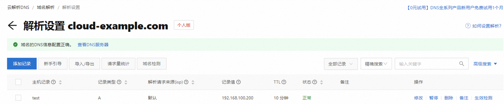

# 第 10 章：云原生应用的内外访问（左右开弓利器）

> **本章目标**：搞清楚 **"云上应用怎么被外面访问"** 和 **"云上应用怎么访问外面（本地 IDC / 其他云）"** 这两件事。前者叫"外网访问"，后者叫"混合云互联"——这两件事加起来，覆盖一个生产级云原生应用 95% 的网络需求。
>
> **本章特色**：把第 6/7 章里用过但没解释清楚的网络组件（**ECS 公网 IP、SAE 公网 CLB 域名、VPC 内网**）放进完整的网络方案地图里，让你看清"哪些场景用哪种连云方式最合适"。

| 场景 | 走哪种方案 | 在哪一节 |
|------|----------|---------|
| 用户用浏览器从外网打开 coffee-app | **域名 + DNS 解析** | Part 2 |
| 公司本地数据中心要安全访问云上 RDS | **VPN 网关**（便宜方案）/ **高速通道**（不差钱） | Part 3 / Part 5 |
| 多个分公司 IDC + 多朵云互联 | **智能接入网关 SAG** / **云企业网 CEN** | Part 4 / Part 6 |
| 本地办公室临时调试云上 Nacos | 第 6 章用过的"公网白名单 + 0.0.0.0/0"（教学权宜） | 第 6 章 Part 3.3 |

---

## 🧭 本章在课程主线里的位置

回想前 7 章你已经做过的事：
- 第 6 章 Part 9：用户浏览器访问 `http://<ECS-3 公网 IP>` 打开前端
- 第 6 章 Part 7.7：SAE 应用通过自动建的 **公网 CLB** 暴露
- 第 6 章 Part 3.3：你本地电脑临时用 **公网白名单 0.0.0.0/0** 连 MSE Nacos 调试

**这些都是"应急做法"或"基础做法"**。生产环境会再升一级：
- 用户访问 → 不能让用户记 IP，要 **域名 + HTTPS**
- 本地连云上资源 → 不能开 `0.0.0.0/0` 公网，要 **VPN 或专线打通内网**

本章就是把这两步"升级"讲清楚。

---

## 目录

- [Part 1 五类云形态速览](#part-1-五类云形态速览)
- [Part 2 域名 + DNS 解析（外网访问）](#part-2-域名--dns-解析外网访问)
- [Part 3 VPN 网关 — 最经济的混合云互联](#part-3-vpn-网关--最经济的混合云互联)
- [Part 4 智能接入网关 SAG — 一站式接入](#part-4-智能接入网关-sag--一站式接入)
- [Part 5 高速通道 — 专线方案（待补充）](#part-5-高速通道--专线方案待补充)
- [Part 6 云企业网 CEN — 全网互联（待补充）](#part-6-云企业网-cen--全网互联待补充)
- [Part 7 四种"连云"方案对比决策树](#part-7-四种连云方案对比决策树)
- [Part 8 把本课程项目放进网络方案地图](#part-8-把本课程项目放进网络方案地图)
- [附录 常见问题](#附录-常见问题)

---

## Part 1 五类云形态速览

> 这一节不操作，目的是让你看清"咱们这门课讲的'阿里云'，是五类里的哪一类"。

### 1.1 用一张表分清"五朵云"

| 云形态 | 一句话定义 | 谁在用 | 谁的机房 |
|--------|----------|--------|---------|
| **公有云** | 所有人共用一个云服务商的资源池 | 任何人 | 云厂商（阿里云、腾讯云等） |
| **专有云 / 行业云** | 云厂商专门为某行业部署一套独立云 | 金融、政务等 | 云厂商，但物理隔离 |
| **专属云** | 阿里云在公有云里给你"独占"一组宿主机 | 对邻居有顾虑的大客户 | 云厂商，但宿主机你独占 |
| **私有云** | 自己在自家机房用 OpenStack / VMware 搭一朵云 | 大企业 / 金融 | 自家机房 |
| **异构云** | 同时用了多个不同云厂商（阿里 + 腾讯 + AWS） | 全球化业务 / 多供应商策略 | 多家 |
| **混合云** | 自家机房 + 公有云，两边都用 | 大多数转型中的传统企业 | 两边都有 |

### 1.2 本课程用的是哪种？

**纯公有云**——你的 coffee-userorder / expresstrack / app 全部跑在阿里云的 ECS / SAE 上，本地笔记本只是开发机。

**但本章 Part 3 / 4 / 5 / 6 讲的方案，都是为了"非纯公有云"场景**：

```
纯公有云                       混合云 / 异构云
   ↓                              ↓
本课程做到这里                  Part 3-6 的方案在这里登场
（域名 + DNS 就够了）           （VPN / SAG / 专线 / CEN）
```

> 学生第一遍跑通课程项目时，**只需要 Part 2（域名 DNS）这一节就够了**。Part 3-6 是"看未来"——等你将来工作进了有本地 IDC 或多云架构的公司，会用得到。

---

## Part 2 域名 + DNS 解析（外网访问）

> **对照前 7 章**：你之前都是 `http://47.96.xxx.xxx:8005` 这种 IP 直连访问。本节做的事就是 **把那个 IP 换成你买的域名**——比如 `http://coffee.example.com`。

### 2.1 为什么不能直接给用户 IP

3 个硬伤：
- IP 难记，用户不会输
- 浏览器对 IP 域不能签 HTTPS 证书（Let's Encrypt 只签域名）
- IP 一变（换 ECS / 换 SLB）所有用户都失联，**域名 + DNS 可以 5 分钟内切流量**

### 2.2 域名服务包含什么

阿里云的"域名服务"是一站式平台，包括：

- **域名注册**：买一个域名（`example.com` 这种），新顶级域 `.xyz` 一年几块钱起，`.com` 几十块
- **实名认证 + 备案**：中国大陆境内服务器必须做 **ICP 备案**（10 天左右），否则访问会被拦截
- **DNS 解析**：把域名 → IP 的映射告诉互联网的 DNS 系统
- **域名监控 / 保护**：防止误删、防转移

最常用的两类 **DNS 解析记录**：

| 记录类型 | 把什么映射到什么 | 本课程用例 |
|---------|----------------|-----------|
| **A 记录** | 域名 → IPv4 地址 | `coffee.example.com → ECS-3 公网 IP` |
| **CNAME 记录** | 域名 → 另一个域名 | （可选进阶）`api.example.com → SAE 公网 CLB 域名` |

> **本课程三条路径的前端都托管在 ECS-3 的 Nginx 上**（见 12 章 Part 7.2），所以 **用户打开的站点域名一律用 A 记录指向 ECS-3 公网 IP**——路径 A / B / C 都一样。
>
> CNAME 在本项目里是 **可选进阶**：路径 C 的前端会把 API 请求发到 **SAE 公网 CLB 域名**（一个 `*.aliyuncs.com` 域名，不是裸 IP），如果你想给这个后端 API 也起个好记的域名（如 `api.example.com`），就用 CNAME 指过去。站点本身的访问不需要它。

### 2.3 操作：用域名替换前 7 章的 IP

#### 第 1 步：买一个域名

1. 阿里云控制台搜 **域名** → 进 **域名服务** → 顶部输入框查询想要的域名 → 加入清单 → 结算
2. 完成 **实名认证**（控制台自动引导上传身份证或营业执照）

   > 📷 截图占位：域名购买与实名认证
   > 🔗 官方截图参考：[阿里云域名注册流程](https://help.aliyun.com/zh/domains/domain-registration)

#### 第 2 步：备案（中国大陆服务器必做）

3. 阿里云控制台搜 **ICP 备案** → 按引导提交资料
4. **等约 10 个工作日** 审核通过

> 教学环境想跳过备案？把 ECS / SAE 实例的地域选 **香港 / 海外**——海外节点不需要 ICP 备案。但延迟会高一点。

#### 第 3 步：在 DNS 解析里添加记录

5. 阿里云控制台搜 **云解析 DNS** → 进 **解析设置** → 找到你的域名 → **添加记录**

   
   > △ 官方文档截图：域名的"解析设置"页——已添加的 A 记录长这样（主机记录 / 记录类型 / 记录值），右上角"添加记录"
   > 🔗 官方文档：[添加解析记录](https://help.aliyun.com/zh/dns/add-a-cname-record)

6. **站点域名（三条路径都这样做）** 用 **A 记录** 指向 ECS-3：

   | 字段 | 填什么 |
   |------|--------|
   | 记录类型 | A |
   | 主机记录 | `coffee` （最终域名是 `coffee.example.com`） |
   | 解析线路 | 默认 |
   | 记录值 | ECS-3 的公网 IP |
   | TTL | 10 分钟 |

   > 前端在三条路径里都托管于 ECS-3 Nginx，所以这一步对路径 A / B / C 完全一致。

7. **（可选，仅路径 C）给后端 API 起个域名** 用 **CNAME**：

   | 字段 | 填什么 |
   |------|--------|
   | 记录类型 | CNAME |
   | 主机记录 | `api` （最终域名是 `api.example.com`） |
   | 记录值 | SAE 公网 CLB 域名（12 章 Part 7.2 用到的那个） |

   > 做了这一步后，前端流水线的 `FRONT_API_URL` 就能填 `http://api.example.com`，而不是那串 `*.aliyuncs.com`。不做也不影响访问——直接用 SAE CLB 原域名即可。

#### 第 4 步：验证

8. 等 1-5 分钟（DNS 全球生效有缓存）
9. 终端测试解析：
   ```bash
   nslookup coffee.example.com
   ```
   能看到指向 ECS-3 公网 IP 即成功
10. 浏览器打开 `http://coffee.example.com` → 看到前端 ✅

> **HTTPS 怎么办**：再多一步——阿里云"SSL 证书"页面 → 申请免费证书 → 验证域名 → 下载证书部署到 ECS-3 的 Nginx。免费证书 1 年有效期，到期续签。这部分不展开，留作你查文档练手。

---

## Part 3 VPN 网关 — 最经济的混合云互联

> 这一节回答：**公司本地办公室 / 本地 IDC，要安全访问云上 RDS 内网，怎么办？**
>
> 第 6 章 Part 3.2 你是 **临时把 RDS 白名单开成公网 + 你电脑 IP**——这是开发期权宜之计，生产里不行。

### 3.1 VPN 网关在干什么

```
本地 IDC                                   阿里云 VPC
┌──────────┐                              ┌──────────┐
│ 你的电脑 │                              │   ECS    │
│ 本地服务器│ ── 加密 IPsec 隧道 ──►       │   RDS    │
│          │     (走公网但全程加密)        │   SLB    │
└────┬─────┘                              └────┬─────┘
     │                                          │
     └──── 本地路由器 ←──ipsec──► VPN 网关 ─────┘
            （需要固定公网 IP）        （阿里云这边的入口）
```

**核心思想**：在本地路由器和阿里云 VPN 网关之间建一条 **加密隧道**，**让本地访问云上 VPC 内网像访问自家局域网一样**——RDS 白名单只需要放本地内网网段，不用再开公网。

### 3.2 适用 / 不适用场景

| 适合 | 不适合 |
|------|--------|
| 本地办公室 / 单个 IDC 连一朵阿里云 | 多个 IDC + 多云互联（用 SAG / CEN） |
| 流量不大（几十 Mbps 级） | 高带宽稳定需求（用专线） |
| 预算紧（按月百元起） | 对网络抖动零容忍（VPN 走公网，会抖） |

### 3.3 IPsec-VPN vs SSL-VPN（两种用法别搞混）

阿里云 VPN 网关下挂两种产品，**解决的不是同一件事**：

| 子产品 | 解决什么 | 谁是"客户端" | 是否要固定公网 IP |
|--------|---------|------------|----------------|
| **IPsec-VPN** | **整个 IDC / 整个网络** 连云上 VPC（站到站） | 本地路由器 | **要**（用户网关必须填固定 IP） |
| **SSL-VPN** | **单个员工的电脑** 远程连云上 VPC | 员工电脑装客户端 | 不需要（出差人员普通宽带也能用） |

> 课程里说的"VPN 网关 = 便宜的混合云方案"特指 **IPsec-VPN**。如果你的诉求只是"几个员工远程访问云上 OA"，**SSL-VPN 更合适**——出差住酒店都能连，零网络硬件要求。

### 3.4 配置思路（操作级见官方文档）

以 **IPsec-VPN 站到站** 为例，3 个核心配置点：

1. **VPN 网关** 在阿里云 VPC 控制台创建，关联你的 VPC
2. **用户网关** 填本地路由器的 **固定公网 IP**（**没固定 IP 走不了 IPsec**——这是 IPsec 协议本身的要求，不是阿里云限制）
3. **IPsec 连接** 配两端的预共享密钥 + 网段路由

   > 📷 截图占位：阿里云 VPN 网关控制台
   > 🔗 官方截图参考：[什么是 IPsec-VPN](https://help.aliyun.com/zh/vpn/sub-product-ipsec-vpn/product-overview/what-is-ipsec-vpn)

> **不建议用 VPN 网关做"VPC 间互连"**——VPC 间互连有 **更好的方案**（Part 6 的云企业网 CEN），便宜、快、运维简单。VPN 留给"本地 IDC ↔ 云"或"个人电脑 ↔ 云"这两个场景。

---

## Part 4 智能接入网关 SAG — 一站式接入

> 这一节回答：**多个分公司、出差员工、其他云上业务，都要安全接入阿里云，怎么办？**
>
> VPN 是"单点对单云"，SAG 是"任意端到云的统一入口"。

### 4.1 SAG 的本质

SAG 是阿里云的 **云原生 SD-WAN 方案**。所谓 SD-WAN 就是"用软件定义的方式管理广域网连接"——你不用懂这个术语，记住 SAG 干这三件事：

```
              ┌──────────────────────────────┐
              │     阿里云 VPC（业务系统）    │
              └─────────────┬────────────────┘
                            │
                  SAG 云端控制器（统一调度）
                            │
       ┌────────────────────┼────────────────────┐
       │                    │                    │
    ┌──┴──┐             ┌──┴──┐             ┌──┴──┐
    │本地 │             │ 别的│             │电脑 │
    │ IDC │             │  云 │             │ 手机│
    │     │             │     │             │     │
    └──┬──┘             └──┬──┘             └──┬──┘
   SAG 硬件              SAG 软件 vCPE       SAG APP
   （盒子）              （装在它们的虚机里）（APP 直接装手机）
```

| 接入端 | 接入方式 | 典型场景 |
|--------|---------|---------|
| 本地 IDC / 分公司 | **SAG 硬件设备**（阿里云寄一个盒子给你） | 公司机房常驻接入 |
| 其它公有云（AWS / Azure / 腾讯云） | **SAG vCPE**（在那朵云的虚机里装阿里云的镜像，把虚机变成"软网关"） | 异构云互联 |
| 出差员工电脑 / 手机 | **SAG APP**（应用商店下载） | 移动办公 |

> **vCPE 一点澄清**：vCPE = Virtual CPE，CPE 就是"客户端设备"。**它本质是阿里云提供的一个系统镜像，你拿这个镜像在 AWS / Azure / 腾讯云的虚机上装一台**，那台虚机就成了"软件版 SAG 盒子"。对于已经在别家云有业务、想顺势接入阿里云的场景特别方便——不用真寄硬件设备到对方机房。

### 4.2 和 VPN 的差别

| 维度 | VPN 网关 | 智能接入网关 SAG |
|------|---------|----------------|
| 接入端要做什么 | 自己装路由器 + IPsec 配置 | 用阿里云寄的盒子 / 装 APP，**开箱即用** |
| 接入端公网 IP | **必须固定** | 不需要 |
| 多分支管理 | 每个分支单独配 | 统一控制台一键下发 |
| 价格 | 按月固定（几百 ~ 千） | 按盒子 / APP 数量 + 流量 |
| 适合 | 单点对云 | 分支多、终端杂、异构云 |

   > 📷 截图占位：SAG 控制台 / 硬件设备
   > 🔗 官方截图参考：[智能接入网关产品概述](https://help.aliyun.com/zh/smart-access-gateway/product-overview/what-is-smart-access-gateway)

---

## Part 5 高速通道 — 专线方案

> 这一节解决：**对网络延迟和稳定性零容忍的业务**（金融交易、医疗影像、跨地域数据库同步等），不接受 VPN 那种"走公网偶尔抖一下"——怎么办？答：**拉根物理专线**。

### 5.1 高速通道在干什么

**一句话**：**在你的本地 IDC 和阿里云机房之间架一根物理光纤**（或租运营商的二层链路），所有数据走这根专线，**完全不经公网**。

要把这件事讲清楚，先认识 3 个核心组件：

| 组件 | 物理层面是什么 | 在阿里云控制台叫什么 |
|------|--------------|-------------------|
| **物理专线** | 一根真实的光纤 / 运营商专线 | "物理专线接入" |
| **接入点（Access Point）** | 阿里云在各大城市的"专线机房入口"——你的专线得从你 IDC 拉到最近的接入点 | "接入点" |
| **边界路由器 VBR**（Virtual Border Router） | 阿里云这一侧的"路由网关"——专线进了接入点之后，挂在 VBR 上，VBR 再去转给后端 VPC | "边界路由器" |

> **VBR 是这一节最容易记混的概念**：它不是物理设备，是阿里云在接入点为你创建的 **逻辑路由器实例**。所有从专线进来的流量，先到 VBR，再由 VBR 决定走向哪个 VPC。

### 5.2 整体拓扑（核实自官方文档）

```
本地 IDC                    运营商专线              阿里云机房
┌──────────┐                ━━━━━━━━━━━           ┌─────────────────┐
│ 你的服务器│ ── 路由器 ──► ▒▒▒物理专线▒▒▒ ──► 接入点 │
│  10.0/16 │                ━━━━━━━━━━━           │     │            │
└──────────┘                                      │     ▼            │
                                                  │  ┌─────┐         │
                                                  │  │ VBR │         │
                                                  │  └──┬──┘         │
                                                  │     │            │
                                                  │  通过 CEN 互通    │
                                                  │     │            │
                                                  │  ┌──┴──────┐     │
                                                  │  │   VPC   │     │
                                                  │  │ ECS/RDS │     │
                                                  │  └─────────┘     │
                                                  └─────────────────┘
```

**关键认知**：**VBR 不直接连 VPC**——VBR 和 VPC 在 **同一个云企业网 CEN 内**，靠 CEN 互通。这就是 Part 6 出场的伏笔。

### 5.3 独享专线 vs 共享专线（教学场景重点）

高速通道有 **两种专线接入方式**，差别巨大：

| 维度 | 独享专线 | 共享专线 |
|------|---------|---------|
| **物理结构** | 运营商从你 IDC 新拉一根专线 → 阿里云接入点 | 运营商已经预先连到了阿里云接入点，你只需要拉到运营商的接入点 |
| **是否独占** | 端口完全独占 | 运营商端到阿里云的链路是**多租户共享** |
| **施工周期** | **1-3 个月** | **1 个月内** |
| **付费给谁** | 运营商 + 阿里云端口费 | 主要付给运营商 |
| **适合谁** | 大带宽、强合规的中大型企业 | **中小客户的高速通道入门方案** |

> **关键认知**：很多人以为"高速通道 = 几十万一年"——那是独享专线。**共享专线把门槛拉低很多**，对"想用专线但量没那么大"的客户是务实选择。

### 5.4 开通流程速览（4 大步）

1. **选独享 or 共享专线** — 按 5.3 的对比选
2. **运营商施工** — 这是大头，**独享 1-3 月，共享 1 月内**
3. **配置 VBR** — 阿里云控制台 → 高速通道 → 创建边界路由器，绑定专线
4. **加入 CEN** — 把 VBR 和你的 VPC 都加进同一个 CEN 实例，开通互通

   > 📷 截图占位：高速通道控制台、VBR 创建界面
   > 🔗 官方截图参考：[什么是高速通道](https://help.aliyun.com/zh/express-connect/product-overview/what-is-express-connect)

### 5.4 适合谁、不适合谁

| 适合 | 不适合 |
|------|--------|
| 金融、政务、医疗等强合规场景 | 初创公司、教学项目 |
| 跨地域数据库主从同步 | 想"今天买明天用"的临时需求 |
| 流量大且稳定（> 100 Mbps 长期占用） | 流量小且波动大（VPN 更划算） |
| 预算充足（万元 / 月起） | 预算紧 |

**和 VPN 的本质对比**：

| 维度 | VPN 网关 | 高速通道 |
|------|---------|---------|
| 走哪里 | 公网（加密隧道） | **专属物理链路** |
| 开通速度 | **分钟级** | **数周到数月**（要等运营商施工） |
| 延迟 | 几十~上百 ms，抖 | **个位数 ms，稳** |
| 带宽 | 几百 Mbps 封顶 | **Gbps 起，最高 100 Gbps** |
| 月费 | 几百~几千 | **万元起** |

> **一句话**："VPN 是穷人版混合云，高速通道是不差钱版"。教学项目永远不会用到，但工作后进金融行业第一周就会接触。

---

## Part 6 云企业网 CEN — 全网互联

> 这一节解决：**手里有多个 VPC（不同地域 / 不同账号）+ 多个本地 IDC + 其它云**，怎么让它们像同一张内网一样互通？答：**全都加进云企业网 CEN**，剩下的让 CEN 自动路由。

### 6.1 CEN 在整体中的位置

CEN 是 **"骨干网层"**，不直接接入端：

```
   接入层（Part 3-5 的方案）         骨干层（Part 6）
   ─────────────────────             ─────────────
   VPN 网关 ─────┐
   SAG ──────────┼──► 把流量送进 ──►  CEN（云企业网）
   高速通道 ─────┘                     │
                                       └─► 自动路由到目标 VPC / 地域 / IDC
```

把 CEN 当成 **"机场枢纽"**：VPN / SAG / 专线是各种"航线"，**CEN 是把所有航线汇总并自动调度的中心机场**。

### 6.2 三个核心概念（核实自官方文档）

| 概念 | 是什么 | 一句话理解 |
|------|-------|----------|
| **CEN 实例** | 你的"全局网络容器" | 一个企业一般建一个 CEN 实例 |
| **转发路由器 TR**（Transit Router） | CEN 在 **每个地域** 提供的"流量交换机"，每地域一台 | 真正干"路由转发"活儿的设备 |
| **网络实例** | 加进 CEN 的网络资源，**支持 VPC、VBR、CCN、IPsec 连接** | 加进来才能互通 |

**4 类网络实例分别对应前面章节的什么**：

| 网络实例 | 全称 | 对应前面的什么 |
|---------|-----|--------------|
| **VPC** | Virtual Private Cloud | 你的 ECS / RDS / SAE 所在的虚拟内网 |
| **VBR** | Virtual Border Router | **Part 5** 高速通道带进来的边界路由器 |
| **CCN** | Cloud Connect Network | **Part 4** 智能接入网关 SAG 上层的连接网络 |
| **IPsec 连接** | — | **Part 3** VPN 网关建出来的隧道 |

> **看出来了吗**：**Part 3 / 4 / 5 的产出物，全都能加进 CEN 当作"网络实例"**。这就是为什么 CEN 被称为"全网互联枢纽"。

### 6.3 同地域互通 vs 跨地域互通

```
                  ┌──────────────────┐
                  │   CEN 实例       │
                  └────────┬─────────┘
                           │
            ┌──────────────┼──────────────┐
            │              │              │
       华东 TR ◄────────►  华北 TR  ◄────►  美西 TR
       （地域内）        （跨地域骨干）    （跨地域骨干）
       │   │              │   │            │   │
      VPC VBR            VPC IDC           VPC CCN
```

- **同地域互通**：网络实例加进同一个地域的 TR，**TR 直接转发**——延迟最低，价格最低
- **跨地域互通**：流量经本地 TR → 阿里云骨干网 → 远端 TR，**按"地域间带宽"计费**

### 6.4 CEN 替代了谁？没替代谁？

| 它替代了 | 它没替代 |
|---------|---------|
| VPC 间手工配置路由（之前要做"对等连接 PrivateLink"） | VPN / 专线 / SAG（这些是接入手段） |
| 跨账号 VPC 互通（之前要写一堆 RAM 角色） | 流量加密（自己得保证）|
| 跨地域 VPC 互通 | 公网入口（域名 DNS 还是要 Part 2） |

**一句话**：CEN 让"加入后即可全网互通"，但 **CEN 本身不是接入手段**——你得先有 VPN / 专线 / SAG / CCN 这些"航线"，才能把流量送进 CEN 枢纽。

### 6.5 基础版 vs 企业版（选规格时一定要看）

CEN 实例分两个版本，能力差距挺大：

| 能力 | 基础版 | 企业版 |
|------|:----:|:----:|
| VPC / VBR / CCN 接入 | ✅ | ✅ |
| **IPsec 连接接入**（把 VPN 隧道直接挂进 CEN） | ❌ | ✅ |
| **自定义路由表 / 路由策略** | ❌ | ✅ |
| **流量调度**（按业务做引流） | ❌ | ✅ |
| **组播** | ❌ | ✅ |
| **流日志**（看流量明细排查问题） | ❌ | ✅ |

**怎么选**：
- 只是几个 VPC 简单互通 → **基础版** 够用
- 要 VPN / 多种接入手段并存、要做路由分流 → **必须企业版**

> **转发路由器 TR 在两个版本里都有**，只是企业版的 TR 功能更完整（路由策略、自定义路由表都得靠企业版 TR）。

### 6.6 计费方式（速览）

CEN 的计费有两块：

1. **转发路由器实例费**：按地域 + 规格按小时收（企业版比基础版贵）
2. **跨地域带宽费**：按地域间带宽包年包月或按使用量

**同地域内网络实例互通免费**，**跨地域带宽是大头**。

   > 📷 截图占位：CEN 控制台 / TR 拓扑视图
   > 🔗 官方截图参考：[云企业网功能特性](https://help.aliyun.com/zh/cen/product-overview/functions-and-features) ｜ [管理转发路由器实例](https://help.aliyun.com/zh/cen/user-guide/transit-routers)

### 6.7 一个典型企业网最终长什么样

```
华东 1（杭州）              华北 2（北京）          美西 1（硅谷）
┌──────────┐                ┌──────────┐           ┌──────────┐
│ VPC-业务A│                │ VPC-业务B│           │ VPC-海外 │
│ VPC-数据 │                │ VPC-测试 │           │          │
│ VBR-专线 │                │          │           │          │
└────┬─────┘                └────┬─────┘           └────┬─────┘
     │                           │                      │
     ▼                           ▼                      ▼
   华东 TR ─────────── 华北 TR ─────────────── 美西 TR
            │                       │
            │  CEN 骨干（阿里云全球网络）│
            │                       │
     ┌──────┴──────┐         ┌──────┴──────┐
     │  VPN 接入   │         │  SAG 接入   │
     │（上海办公室）│         │（深圳/广州  │
     │             │         │  多分公司） │
     └─────────────┘         └─────────────┘
```

> 看到这个图，你应该感受到 Part 1-6 一脉相承的"网络组装"思路：**接入手段（VPN / SAG / 专线）** + **骨干（CEN + TR）** + **接入端（VPC / IDC / 其它云）** = 一张完整的企业级混合云网络。

---

## Part 7 四种"连云"方案对比决策树

```
你要解决什么问题？
│
├─ 用户从外网访问云上业务
│   └─► Part 2 域名 + DNS 解析
│
├─ 本地一个 IDC / 办公室 安全连云上 VPC
│   ├─ 预算紧、流量小  ──► Part 3 VPN 网关
│   ├─ 需要稳定大带宽  ──► Part 5 高速通道
│   └─ 想"开箱即用"   ──► Part 4 SAG（阿里云寄盒子）
│
├─ 多分支 / 多终端 / 多云接入
│   └─► Part 4 SAG（统一接入）
│
└─ 多 VPC、多地域、多云、本地 IDC 全部要互通
    └─► Part 6 云企业网 CEN（作为骨干）
        + Part 3/4/5 任一作为接入手段
```

---

## Part 8 把本课程项目放进网络方案地图

教学项目目前的网络长这样：

```
互联网用户
    │
    │  ① 打开站点 http://<ECS-3 公网 IP 或域名>（三条路径都在 ECS-3 Nginx 取前端）
    ▼
ECS-3 公网 IP（Nginx 托管前端，三路径共用）  ◄── ② Part 2 加域名（A 记录）
    │
    ├─ 路径 A/B：前端的 API 打到 ECS-3 上的 coffee-app :8005
    └─ 路径 C：前端的 API 打到 SAE 公网 CLB 域名（后端 API，可选 CNAME 起友好域名）
    │
    │  内网调用（同 VPC）
    ▼
ECS-1 / ECS-2 / RDS / MSE Nacos  （路径 C 后端换成 SAE 实例）
    ▲
    │  ③ 你本地电脑临时用公网白名单
    │     （第 6 章 Part 3.3 的权宜做法）
    │
    └──── 升级方向：用 Part 3 VPN 网关 替代公网白名单
```

**对应升级清单**：

| 当前做法 | 本章对应升级 |
|---------|------------|
| ① 用户直接用 ECS-3 公网 IP 访问站点 | **Part 2** 加域名（A 记录）+ HTTPS |
| ② 本地电脑灌 RDS 数据走外网地址 | **Part 3** VPN 网关 + 走 RDS 内网 |
| ③ MSE Nacos 公网白名单 `0.0.0.0/0` | **Part 3** VPN 后只放本地网段 |
| ④ 多分支办公室都要接 | **Part 4** SAG |
| ⑤ 跨地域容灾 | **Part 5 + Part 6** 专线 + CEN |

**这一章学完，你心里要有这样一张"网络方案地图"**——下次同事问"我们公司本地有 5 个分公司要接阿里云怎么搞"，你能秒答 "SAG + CEN"，而不是茫然查文档。

---

## 附录 常见问题

**Q：必须备案吗？我只是想做实验**

中国大陆地域的 ECS / SAE 必须备案。教学实验把实例换到 **香港 / 新加坡 等海外地域**即可跳过备案，唯一代价是延迟略高（国内访问海外节点约 100ms）。

**Q：VPN 网关一直连不上**

99% 是 **本地路由器没有固定公网 IP**——家用宽带、4G 网络都是动态 IP，不能用。要找运营商办企业固定 IP 业务。

**Q：SAG 硬件设备值多少钱？**

设备本身免费（阿里云寄给你），但要 **预付一年服务费**——最低端规格几千一年，中等规格上万。学生不用真买，了解概念即可。

**Q：CEN 是不是把所有方案都替代了？**

不是。CEN 是 **"骨干网"**，本身不接入端——还是要靠 VPN / SAG / 专线作为"接入手段"，CEN 负责接入之后的路由和互通。**CEN + 接入手段** 是组合关系，不是替代关系。

---

[← 返回主文档](../README.md) | [上一章：CI/CD 流水线](07-cicd-pipeline.md)
