# 第 14 章：云原生应用的测试与运维（重中之重）

> **本章目标**：应用上云只是开始——**怎么知道它健康？挂了怎么报警？慢了怎么定位瓶颈？业务跑得好不好怎么看？**。本章覆盖云原生测试 + 运维的 8 个关键工具，每个都对应一个**前面章节做不到的事**。
>
> **本章特色**：每节都按 **"咱们项目目前怎么做 → 升级版用这个云服务"** 的对照展开，让你立刻看见这个工具能解决项目里的哪个痛点。

| 节 | 工具 | 一句话定位 | 解决项目里的什么痛点 |
|----|------|-----------|-------------------|
| Part 1 | **PTS** 性能测试 | SaaS 压测平台 | 上线前不知道扛多少并发 |
| Part 2 | **EMAS** 移动研发 | 移动 APP 全生命周期 | 当前项目没移动端，了解即可 |
| Part 3 | **云监控** CloudMonitor | 基础设施层监控 | ECS/RDS 是否健康一目了然 |
| Part 4 | **ARMS** 应用监控 | 应用层 APM + 全链路 | 一次下单请求慢在哪 |
| Part 5 | **SLS** 日志服务 | 日志中心 + 操作审计 | 不用 SSH 上 ECS `tail -f` 看日志 |
| Part 6-7 | **QuickBI** | 自助 BI 报表 | 业务方自己拉数据看趋势 |
| Part 8 | **DataV** | 数据可视化大屏 | 老板汇报 / 演示用的酷炫大屏 |

---

## 🧭 本章在课程主线里的位置

前 8 章你的项目能力：
- 写代码 ✓ | 上云跑 ✓ | 自动化部署 ✓ | 内外网络打通 ✓

**但这 4 个能力解决的都是"让它跑"——本章解决"跑得好不好"**：

```
能跑     → 测得动 → 看得清 → 调得了 → 老板能直观看
（前 8 章）  PTS     云监控    ARMS     QuickBI/DataV
                    + SLS
```

> 学生第一遍课程，前 5 个工具（PTS / 云监控 / ARMS / SLS）必学，后 3 个（EMAS / QuickBI / DataV）了解概念即可。

### 🎯 初学者三步走（怕迷路看这里）

本章 8 个工具不是都要上手，第一遍只需要：

1. **动手做 2 个**：Part 3 云监控（给 ECS 配一条 CPU 告警，10 分钟）+ Part 5 SLS（把 3 台 ECS 日志收到一个搜索框里，10 分钟）——这两个是所有项目都要的"标配"
2. **上线前做 2 个**：Part 1 PTS（压一次测看能扛多少人）+ Part 4 ARMS（装个探针看请求慢在哪）
3. **听概念就行**：Part 2 EMAS、Part 6-8 QuickBI/DataV——知道"有这个东西、解决什么问题"即可，将来用到再回来查

> 一句话记住本章：**云监控管机器、ARMS 管代码、SLS 管日志、PTS 管容量——四件套配齐，系统才算"看得见"。**

---

## 目录

- [Part 1 PTS — 压测云上业务能扛多少并发](#part-1-pts--压测云上业务能扛多少并发)
- [Part 2 EMAS — 移动 APP 全生命周期（了解）](#part-2-emas--移动-app-全生命周期了解)
- [Part 3 云监控 CloudMonitor — 基础设施层自动化运维](#part-3-云监控-cloudmonitor--基础设施层自动化运维)
- [Part 4 ARMS — 应用层 APM + 全链路追踪](#part-4-arms--应用层-apm--全链路追踪)
- [Part 5 SLS — 日志中心 + "废掉 Root 账号"](#part-5-sls--日志中心--废掉-root-账号)
- [Part 6 QuickBI 速览 — 自助 BI 报表](#part-6-quickbi-速览--自助-bi-报表)
- [Part 7 用 QuickBI 给本项目做自定义报表](#part-7-用-quickbi-给本项目做自定义报表)
- [Part 8 DataV — 数据可视化大屏](#part-8-datav--数据可视化大屏)
- [Part 9 一张图：8 个工具在项目里的位置](#part-9-一张图8-个工具在项目里的位置)
- [附录 常见问题](#附录-常见问题)

---

## Part 1 PTS — 压测云上业务能扛多少并发

> **对照前面章节**：你 06 章做了 3 条上云路径，但 **从来没问过"我这套架构最多能扛多少并发用户下单"**。线上一波流量打过来直接挂掉就是上线事故——PTS 让你在上线前先压一遍。

### 1.1 PTS 是什么

阿里云 **PTS（Performance Testing Service）= SaaS 化的分布式压测平台**。你**不用准备压测机**，PTS 调度全国 CDN 节点的资源同时模拟用户流量，把请求打到你的应用。

**和 JMeter 是什么关系？**

| 维度 | 你本地 JMeter | PTS |
|------|--------------|-----|
| 压测机 | 你自己电脑（4 核 8G 最多 1000 并发） | 阿里云全国节点（百万级并发） |
| 流量来源真实度 | 一个固定 IP（容易被 WAF 拦） | 真实分布的 CDN 节点 IP |
| 脚本兼容 | 自己写 .jmx | **完全支持 .jmx 上传** + 4 种其他建场景方式 |
| 报告 | 自己 jmeter -g 生成 HTML | 实时大盘 + 历史对比 |

> 一句话：**JMeter 脚本不变，扔进 PTS 就能跑大规模分布式压测**。学过 JMeter 的同学这一节零学习成本。

### 1.2 PTS 提供的 4 种创建场景方式

1. **可视化无代码编排**：拖拽配置 API + 参数 + 断言
2. **Chrome 插件录制**：浏览器开 PTS 插件操作一遍，自动生成脚本
3. **脚本导入**：把已有压测脚本导入 PTS 的编排界面
4. **JMeter 原生引擎**：把 .jmx 文件直接传上来，用原生 JMeter 引擎压测

> **本课程推荐路径**：先用 **方式 4（JMeter）** —— 大多数学校 / 培训会教 JMeter，跑通后再去玩 PTS 原生编排。

### 1.3 给本项目做一次压测（操作思路）

**压测目标**：把第 6 章部署的 coffee-app 网关 `/order/create` 接口打到极限，看 3 个 ECS 架构能扛多少 RPS（每秒请求数）。

1. PTS 控制台 → **创建压测场景** → 选 **JMeter 脚本**
2. 写一个最简的 `.jmx`：HTTP 请求 `POST http://<前端 SLB 域名>/api/order/create`，body 是个 JSON
3. 上传脚本 + 配置 **压测梯度**（比如 0 → 100 → 500 → 1000 并发，每档 1 分钟）
4. 启动 → 看实时 RPS / 平均延迟 / 错误率
5. 找到 **错误率开始飙升的那个并发点**——那就是你这套架构当前的"容量上限"

   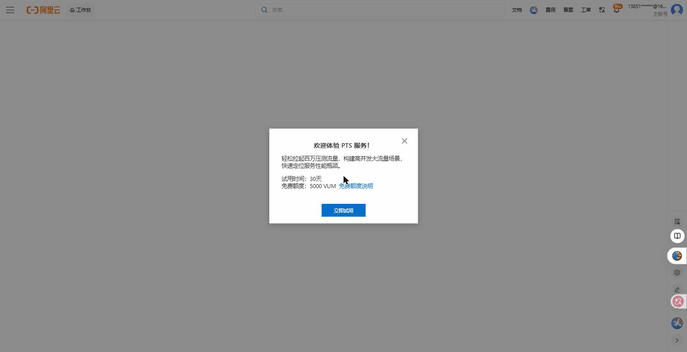
   > △ PTS 性能测试控制台（[ptsnext.console.aliyun.com](https://ptsnext.console.aliyun.com)）首次进入：30 天试用 + 5000 VUM 免费额度，点"立即试用"后即可创建压测场景、看实时大盘。
   > 🔗 官方文档：[PTS 产品概述](https://help.aliyun.com/zh/pts/product-overview/what-is-pts)

### 1.4 压测发现问题后怎么办

PTS 只告诉你"扛不住了"，**定位"哪里扛不住"要靠 Part 4 的 ARMS**——这是本章工具组合拳的第一个例子：

```
PTS 打流量 → ARMS 看链路追踪 → 发现是 RDS 慢查询 → 加索引或扩容
```

---

## Part 2 EMAS — 移动 APP 全生命周期（了解）

> 本课程的 coffee 项目是 Vue Web 端 + Java 后端，**没有移动 APP**。这一节简要了解 EMAS 是什么，将来转岗做移动开发时知道有这套工具。

### 2.1 EMAS 的 6 个核心子服务

EMAS = Enterprise Mobile Application Studio，阿里云的"移动一站式研发平台"，把 APP 从开发到运营的各个工具打成一个包：

| 子服务 | 解决什么 | 类比常见竞品 |
|--------|---------|------------|
| **移动推送** | 给 APP 用户发推送通知 | 极光推送、个推 |
| **HTTPDNS** | 替代系统 DNS，防域名劫持 + 精准调度 | DNSPod HTTPDNS |
| **崩溃分析** | APP 崩溃堆栈收集 + 聚类分析 | Bugly、Firebase Crashlytics |
| **性能分析** | APP 启动时间、卡顿、内存监控 | Bugly 性能 |
| **移动测试** | 真机云测，自动化兼容性测试 | TestIn |
| **移动热修复** | 不发版直接修 Bug | Sophix（前身） |

   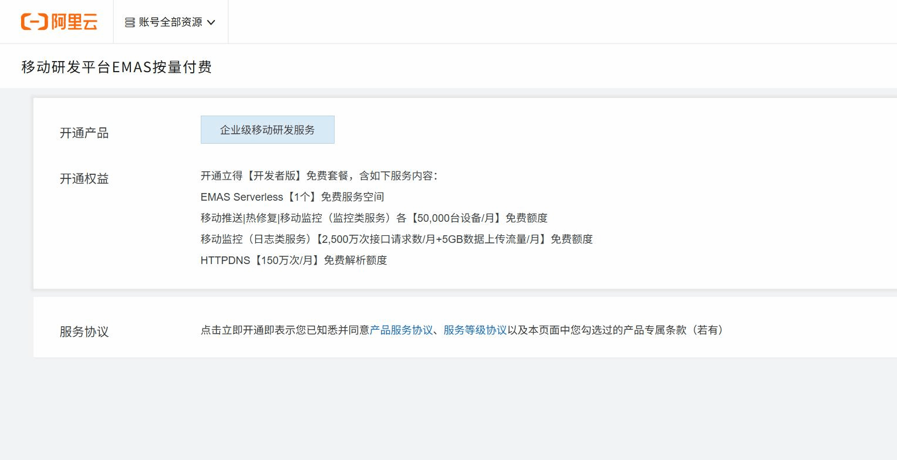
   > △ EMAS 移动研发平台开通页：开发者版免费套餐含 EMAS Serverless、移动推送、移动监控、HTTPDNS 等子服务的免费额度——正好对应本节列的几个子服务。
   > 🔗 官方文档：[EMAS 产品页](https://www.aliyun.com/product/emas)

### 2.2 和本课程项目的关系

如果哪天 coffee 项目要做 APP 端：
- 后端 API（咖啡网关）不变
- APP 接入 EMAS 推送 → 订单完成自动通知用户
- APP 接入 HTTPDNS → 海外用户也能稳定解析后端域名
- 接入崩溃分析 → 见到 ANR 直接看堆栈

**本节不展开**，重点在"知道阿里云有这套东西，要做 APP 时不用从零自建工具链"。

---

## Part 3 云监控 CloudMonitor — 基础设施层自动化运维

> **对照前面章节**：你 06 章建的 ECS / RDS / MSE，**有没有出现过 CPU 烧到 100% 你完全不知道？** 云监控就是干这个的——盯死所有云资源，出问题主动喊你。

### 3.1 云监控管什么、不管什么

云监控 = **基础设施层的"体检报告 + 告警喇叭"**：

| 它管什么 | 它不管什么 |
|---------|----------|
| ECS 的 CPU / 内存 / 磁盘 / 网络 | 你 Java 代码哪个方法慢（那是 Part 4 ARMS） |
| RDS 的连接数 / QPS / 慢 SQL 数 | 业务订单量是否异常（那是 Part 6 QuickBI） |
| SLB 的请求数 / 异常请求 | 用户在 APP 里点了几下（那是 Part 2 EMAS） |
| 你自定义上报的业务指标 |  |

> 一句话：云监控管 **"机器和阿里云产品的健康"**，应用代码层面的事要 Part 4 ARMS。

### 3.2 给本项目配 3 条最基础的告警

来一组立刻能用的最小配置：

| 告警 | 触发条件 | 推送方式 |
|------|---------|---------|
| ECS CPU 持续过载 | 5 分钟内 CPU > 80% | 钉钉群机器人 |
| RDS 连接数告急 | 当前连接数 > 80% 实例上限 | 钉钉 + 短信 |
| SLB 5xx 飙升 | 每分钟 5xx 数 > 50 | 钉钉 + 电话 |

配置步骤：
1. 云监控控制台 → **报警服务 → 报警规则 → 创建报警规则**
2. **资源范围** 选你要监控的 ECS / RDS / SLB
3. **规则** 选指标 + 阈值
4. **通知方式** 选钉钉机器人 / 短信 / 电话

   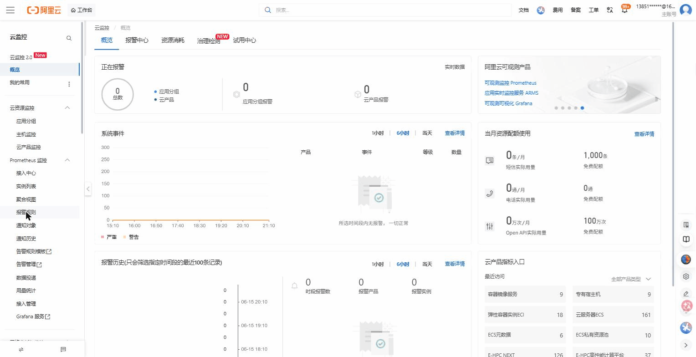
   > △ 云监控控制台（[cloudmonitornext.console.aliyun.com](https://cloudmonitornext.console.aliyun.com)）概览：正在报警/系统事件/报警历史/资源配额一目了然；**左侧导航的"报警规则"** 就是创建本节那 3 条告警的入口。
   > 🔗 官方文档：[云监控产品概述](https://help.aliyun.com/zh/cms/product-overview/what-is-cloudmonitor)

### 3.3 "自动化运维"的真正含义

云监控不仅会"喊人"，还能 **触发自动动作**：

- 检测 ECS CPU > 90% → **自动触发弹性伸缩** 加机器
- 检测进程挂了 → **自动触发函数计算 FC** 跑修复脚本
- 检测磁盘满 → **自动通知 + 清理临时文件**

这就是把 **"7×24 人盯监控"** 替换成 **"机器盯机器，人盯异常"** ——所谓"自动化运维"的本质。

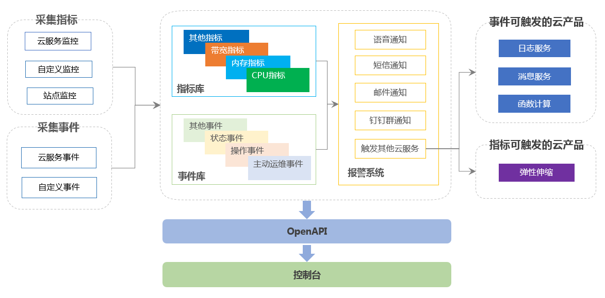
> △ 官方架构图：左边采集指标/事件，中间指标库+报警系统，右边就是上面说的"自动动作"——通知到人（短信/钉钉/电话）或触发云产品（弹性伸缩、函数计算、日志服务）

---

## Part 4 ARMS — 应用层 APM + 全链路追踪

> **对照前面章节**：第 6 章你的下单链路 `coffee-app → userorder → RDS` + `coffee-app → expresstrack → RDS`。**当用户反馈"下单慢"时，慢在哪一段？** 用 SSH 上 3 台 ECS 一个个 `tail -f` 看日志？太慢。ARMS 给你一张图直接告诉你慢在哪。

### 4.1 ARMS 是什么

ARMS = **应用实时监控服务**，阿里云的 **APM（应用性能管理）** 产品。和云监控的核心区别：

| 维度 | 云监控 | ARMS |
|------|-------|------|
| 监控对象 | 机器和云产品 | **应用代码本身** |
| 数据来源 | 阿里云后端采集 | **Agent 装在你的应用里采集** |
| 能看到什么 | "ECS-1 CPU 80%" | "OrderServiceImpl.create 方法 P99=2.3s，其中 1.8s 花在 RDS 慢 SQL" |

### 4.2 ARMS 的核心子产品

| 子产品 | 干嘛的 |
|--------|--------|
| **应用监控**（Java APM） | Java 应用方法级追踪，分布式调用链 |
| **前端监控** | 前端 JS 报错、白屏、慢页面 |
| **Prometheus 监控** | 兼容开源 Prometheus 生态 |
| **Grafana 服务** | 免运维的 Grafana 大盘 |
| **告警管理** | 各子产品的告警统一收口、降噪、分派 |
| **应用监控 eBPF 版** | K8s 场景下不改代码直接采集 |
| **云拨测** | 全球节点访问你的网站，看可用性和延迟 |

> 子产品清单核对自官方"什么是 ARMS"页（官方还有"应用安全"即 RASP，安全话题见第 15 章）。

### 4.3 给本项目接 ARMS（Java 应用 Agent 方式）

3 步搞定:

1. ARMS 控制台 → **应用监控 → 接入应用** → 选 Java
2. 复制控制台给的 **启动参数**（一串 `-javaagent:/path/to/arms-agent.jar -Darms.licenseKey=xxx -Darms.appName=coffee-userorder`）
3. 把这段加进你 `manage.sh` 的 `JAVA_OPTS`，重启服务 → 1 分钟后 ARMS 控制台就看到应用了

   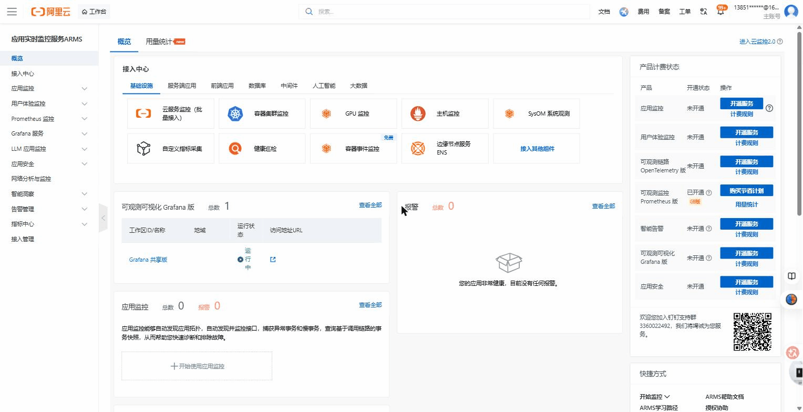
   > △ ARMS 应用实时监控控制台（[arms.console.aliyun.com](https://arms.console.aliyun.com)）概览：中间"接入中心"按基础设施/服务端应用/前端应用等分类提供接入入口，左侧"应用监控"进去后即可看调用链。
   > 🔗 官方文档：[ARMS 产品概述](https://help.aliyun.com/zh/arms/product-overview/what-is-arms)

### 4.4 Agent 装上后能看到的"魔法"

举个真实例子。用户报"下单慢"，你打开 ARMS 应用监控：

```
POST /order/create  耗时 2400 ms
 └─ coffee-app: 路由解析 5ms
     └─ Dubbo call userorder.create: 1900 ms
         └─ OrderServiceImpl.create: 50ms
             └─ MySQL: INSERT order...: 1800 ms   ← 凶手在这
                 (慢 SQL: 缺索引 user_id)
     └─ Dubbo call expresstrack.create: 480 ms
         └─ 正常
```

整条链路从前端入口到 RDS 的每个方法、每个 SQL 都看得清清楚楚——**不用进任何机器、不用看任何日志**，瓶颈一眼定位。这就是 APM 的核心价值。

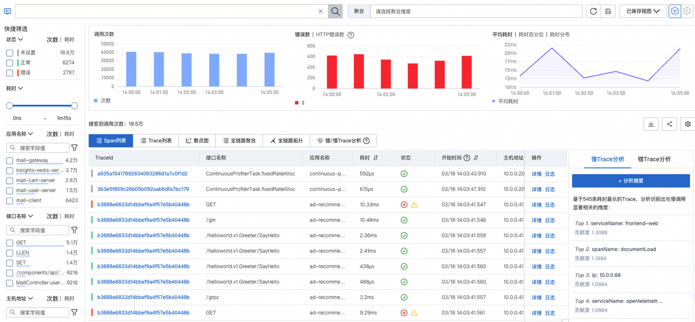
> △ 阿里云官方文档截图：ARMS 的调用链查询页——上方是请求量/耗时/错误数曲线，下方每一行就是一次真实请求，点进去就能看到上面那种逐层耗时分解

### 4.5 ARMS 和 PTS 的组合打法

```
1. PTS 压一波流量
2. ARMS 看链路追踪，找到 P99 异常的接口
3. 看那个接口的慢 SQL / 慢 RPC
4. 优化代码或加索引
5. PTS 再压一波验证
```

这个循环是 **云原生应用上线前的标准动作**。

---

## Part 5 SLS — 日志中心 + "废掉 Root 账号"

> **对照前面章节**：06 章你的日志在 ECS 的 `~/coffee/logs/*.log`，**看日志要 SSH 上去**。3 台 ECS 你跳来跳去看，10 台 ECS 你疯掉。SLS 把所有日志汇到一个地方，**还能彻底废掉"运维登录 Root 账号"这件事**。

### 5.1 SLS 能采什么、不能采什么

**SLS（Simple Log Service）= 阿里云的"日志大本营"**。它能接 **几乎一切来源** 的日志：

| 来源 | 怎么接 |
|------|--------|
| ECS 上的应用日志 | 装 **Logtail** Agent（一行命令） |
| 阿里云产品日志（RDS / SLB / OSS 等） | 控制台一键勾选投递 |
| K8s 容器日志 | DaemonSet 部署 Logtail |
| **操作审计 ActionTrail** | 一键投递（Part 5.3 详讲） |
| 客户端 / 移动端 / IoT | SDK / HTTP API |

采集后 SLS 提供 4 类核心能力：
- **索引查询**：百亿级日志毫秒级查询
- **SQL 分析**：直接用 SQL 跑分析（"过去 1 小时各 ECS 的 ERROR 数")
- **告警**：日志匹配规则自动告警（钉钉 / 短信 / Webhook）
- **AI 辅助**：用自然语言生成查询语句

### 5.2 给本项目接 SLS（10 分钟见效）

1. SLS 控制台 → **创建 Project + Logstore**（Logstore 就是日志库）
2. 在 3 台 ECS 上一行命令装 Logtail：
   ```bash
   wget http://logtail-release-cn-hangzhou.oss-cn-hangzhou.aliyuncs.com/linux64/logtail.sh -O logtail.sh && \
   chmod +x logtail.sh && ./logtail.sh install <地域>
   ```
3. SLS 控制台 → 数据接入 → 选 **"采集本地文件"** → 路径填 `/root/coffee/logs/*.log`
4. **1 分钟后** SLS 控制台搜索栏就能搜到 3 台 ECS 的日志

**从此查日志再也不用 SSH** —— 一个搜索框搞定。

   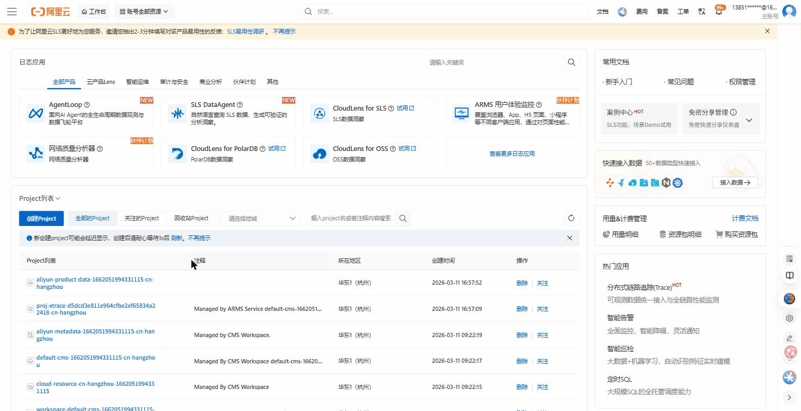
   > △ SLS 日志服务控制台（[sls.console.aliyun.com](https://sls.console.aliyun.com)）：上方"日志应用"+右侧"接入数据"，下方"Project 列表"（一个 Project 就是一个日志库）。点进 Logstore 即是带搜索栏的查询页。
   > 🔗 官方文档：[SLS 产品概述](https://help.aliyun.com/zh/sls/product-overview/what-is-log-service)

### 5.3 SLS + ActionTrail = "废掉 Root 账号"

> 这一节解释源课程标题"如何用日志服务 SLS **废掉 Root 账号**"是啥意思——不是真把 Root 删了，而是 **让任何人都不需要登录 Root 也能完成运维工作**。

**传统做法的坑**：
- 每个运维都拿主账号密码，**操作不留痕**
- 出事后查"是谁误删了 RDS"——查不到
- 主账号 AK 一旦泄露，整个云全完

**云原生做法（4 件事一起做）**：

1. **主账号锁起来**：开启 MFA，密码改超长且只放保险柜
2. **每个员工开 RAM 子账号**：按岗位授权（只读 / 运维 / 开发）
3. **开通 ActionTrail**：记录所有人通过控制台 / API 的每一次操作
4. **ActionTrail 投递到 SLS**：所有操作日志集中化、可查询、可告警

```
任何人操作云资源
        ↓
   阿里云 API
        ↓
  ActionTrail 记录  ───投递───►  SLS
       ↑                          ↓
   90 天默认保留              永久保留 + 自定义查询
                              + 异常告警
```

**有了这套**：
- 谁、何时、从哪个 IP、对什么资源做了什么操作——全留痕
- "RDS 被误删"的事故，30 秒查到操作人
- "凌晨 3 点有人登录主账号"——SLS 告警马上炸钉钉群

**这就是"废掉 Root 账号"的真正含义** —— 你不再需要 Root 登录，因为：
- 所有日常操作子账号搞定
- 所有动作 ActionTrail + SLS 留痕
- Root 只在紧急情况下用（且每次用都被记录）

   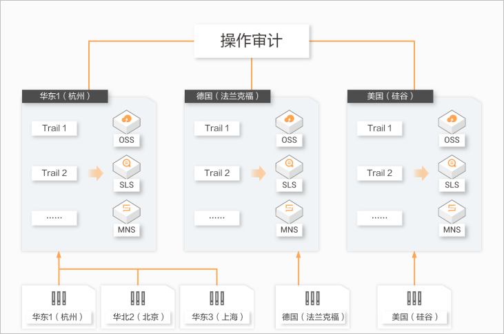
   > △ 官方架构图：所有地域的操作事件由 ActionTrail 统一收集，按"跟踪"投递到 OSS / SLS / MNS——我们用的就是投递 SLS 这条
   > 🔗 官方文档：[ActionTrail 产品概述](https://help.aliyun.com/zh/actiontrail/product-overview/what-is-actiontrail)

### 5.4 给本项目设 3 条 SLS 告警

| 告警 | 匹配规则 | 通知 |
|------|---------|------|
| 应用 ERROR 飙升 | 每分钟 ERROR 数 > 20 | 钉钉群机器人 |
| 主账号登录 | ActionTrail 事件 `ConsoleSignin` 且操作人 = 主账号 | 短信 + 电话 |
| RDS 慢 SQL 增多 | RDS 慢日志数 > 100/min | 钉钉 |

---

## Part 6 QuickBI 速览 — 自助 BI 报表

> **对照前面章节**：你 04 章给项目设计了订单表、快递表。**业务方要"看今天下单量趋势"** 怎么办？写 SQL？写代码出图？太慢。QuickBI 让业务方自己拖拉拽就出图。

### 6.1 QuickBI 是什么

QuickBI = 阿里云的 **自助式商业智能（BI）平台**：

- **面向业务人员**，不是给程序员的（程序员有 Grafana / Superset）
- **拖拽出图**，不写 SQL（高级用户也可以写）
- 多次入选 Gartner BI 魔力象限的国产 BI 产品（入选年份/次数以阿里云官网最新宣传为准）

### 6.2 3 类作品形态

QuickBI 把"报表"分成 3 类，**各有用法**：

| 作品类型 | 长什么样 | 适合 |
|---------|---------|------|
| **仪表板（Dashboard）** | 多个图表组成的交互式看板 | 日常运营看 KPI（最常用） |
| **电子表格** | 像 Excel 一样的网页表格 | 财务、明细数据导出 |
| **数据大屏** | 全屏酷炫展示 | 老板汇报、活动现场（DataV 的简化版） |

### 6.3 支持哪些数据源

最常用：
- **阿里云 RDS**（本课程项目用的 MySQL）
- **MaxCompute / ADB**（大数据场景）
- **本地 Excel / CSV** 上传
- **API 接口**（少见）

> **本节关键**：把 QuickBI **连上本项目的 RDS**，业务报表立刻可做。下一节具体操作。

---

## Part 7 用 QuickBI 给本项目做自定义报表

把第 4 章的 `order` 表接进 QuickBI，做一个"今天 vs 昨天下单量趋势"仪表板。整个过程就三步，和"做 PPT"差不多：

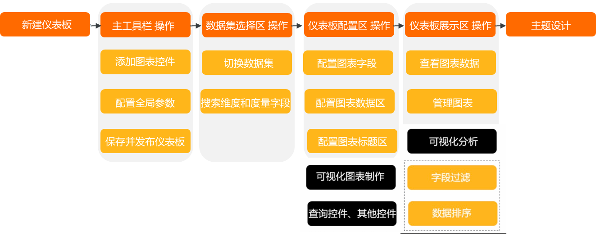
> △ 阿里云官方流程图：连数据源 → 建数据集 → 拖图表做仪表板，全程不写代码

### 7.1 第 1 步：连数据源

1. QuickBI 控制台 → **数据源 → 新建数据源** → 选 **MySQL**
2. 填 RDS **内网地址 + 账号 + 密码**（用 06 章 Part 3.2 创的那个）

   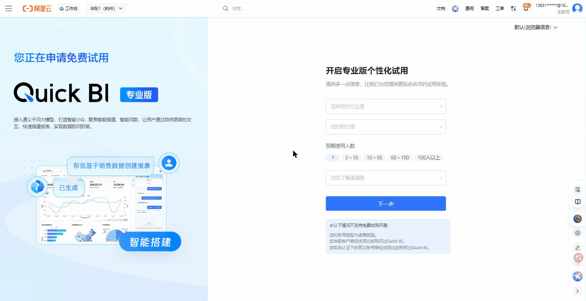
   > △ Quick BI（[das.base.shuju.aliyun.com](https://das.base.shuju.aliyun.com)）专业版入口：开通/进入后在"数据源 → 新建数据源"里选 MySQL 连本项目 RDS（左侧示意图即拖拽生成的报表仪表板）。
   > 🔗 官方文档：[QuickBI 数据源连接](https://help.aliyun.com/zh/quick-bi/user-guide/connect-to-data-sources)

3. **测试连接 → 确定**

> **RDS 白名单坑**：QuickBI 用的 IP 段不在你 ECS / SAE 的网段里——**得把 QuickBI 的公网 IP 段加进 RDS 白名单**，控制台会给你列出。这和 06 章 Part 7.4 那个"SAE 虚拟交换机（VSwitch）网段加白名单"的坑是一类。

### 7.2 第 2 步：建数据集

数据集 = 给原始表加一层"业务语义"。

4. **新建数据集** → 选 `order` 表
5. 把字段重命名为业务方看得懂的名字：`create_time` → "下单时间"，`amount` → "订单金额"
6. 新增计算字段："订单日期" = `DATE(create_time)`

### 7.3 第 3 步：拖一个仪表板

7. **新建仪表板** → 拖一个 **折线图** 到画布上
8. 把"订单日期"拖到 X 轴，"订单金额求和"拖到 Y 轴
9. 加 **筛选条件**：日期范围 = 最近 7 天
10. 保存 → 仪表板出炉 ✅

    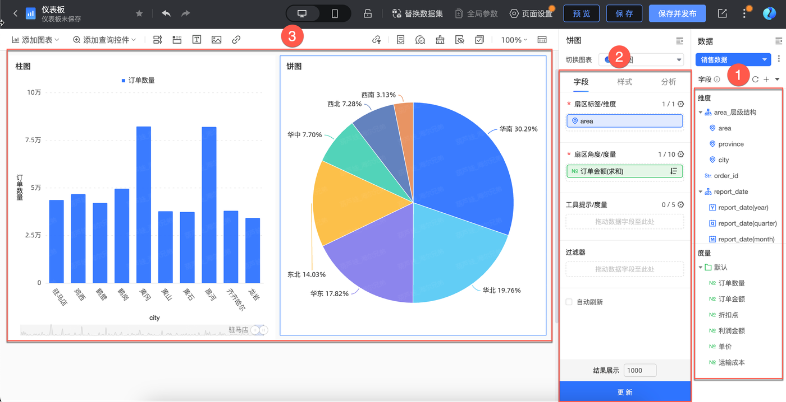
    > △ 阿里云官方文档截图：编辑器分三块——①右侧选数据集字段，②中间把字段拖到维度/度量，③左侧画布实时出图

   
   > △ Quick BI 专业版：进入工作空间后"新建仪表板"，把维度/度量字段拖到画布即出图（左侧示意图就是拖拽生成的多图表仪表板）。
   > 🔗 官方文档：[QuickBI 智能数据分析可视化](https://help.aliyun.com/zh/quick-bi/product-overview/introduction-to-quick-bi-1)

11. **分享给业务方**：仪表板有公开链接 + 权限管理，业务方打开链接就能看，不用学 SQL。

### 7.4 业务方能做什么、不能做什么

| 业务方能 | 业务方不能 |
|---------|----------|
| 改筛选条件（日期 / 商品类目） | 改底层 SQL |
| 导出 Excel 给老板 | 删数据 |
| 加新图表（在你给的数据集里） | 连新数据源 |

这种 "**数据工程师建数据集 + 业务方自助分析**" 是 BI 的标准协作模型——把"取数据"和"看数据"职责分开。

---

## Part 8 DataV — 数据可视化大屏

> **对照前面**：QuickBI 做的"数据大屏"是简化版，给日常用。**老板年终汇报、客户来公司参观、活动现场墙上挂的那种酷炫大屏** —— 上 DataV。

### 8.1 DataV 和 QuickBI 的本质区别

| 维度 | QuickBI | DataV |
|------|--------|-------|
| **解决什么** | 让业务方**自助分析数据** | 让数据**酷炫展示** |
| **核心场景** | 日报、周报、KPI 看板 | 老板汇报、活动大屏、监控墙 |
| **交互** | 强（点哪个图都能下钻） | 弱（多数时候只是展示） |
| **视觉效果** | 规整 | **极强**（动效、3D、地图、视频集成） |
| **学习门槛** | 业务方能上手 | 偏设计 / 前端思路 |

**一句话**：**"QuickBI 是工作日的工具，DataV 是会议室的工具"**。

### 8.2 DataV 的典型用法

1. **监控大屏**：把云监控 + ARMS + SLS 的核心指标做成动效大屏，挂在 NOC（网络运营中心）墙上
2. **业务大屏**：双 11 实时成交额滚动展示
3. **GIS 地理大屏**：物流公司展示全国包裹分布
4. **会议汇报**：把 Q4 业绩做成单页交互式大屏

### 8.3 给本项目做一个"实时下单大屏"

思路（不展开操作步骤，留作课程作业）：

1. DataV 控制台 → **创建大屏** → 选模板（推荐"通用模板"）
2. 添加组件：
   - 大数字组件：今日订单量、今日 GMV
   - 折线图组件：近 24 小时下单趋势
   - 中国地图组件：各省订单热力（要 order 表有 province 字段）
   - 排行榜组件：Top 10 热销咖啡
3. 数据源连本项目的 RDS（同 Part 7.1）
4. **预览全屏** → 投到大屏

   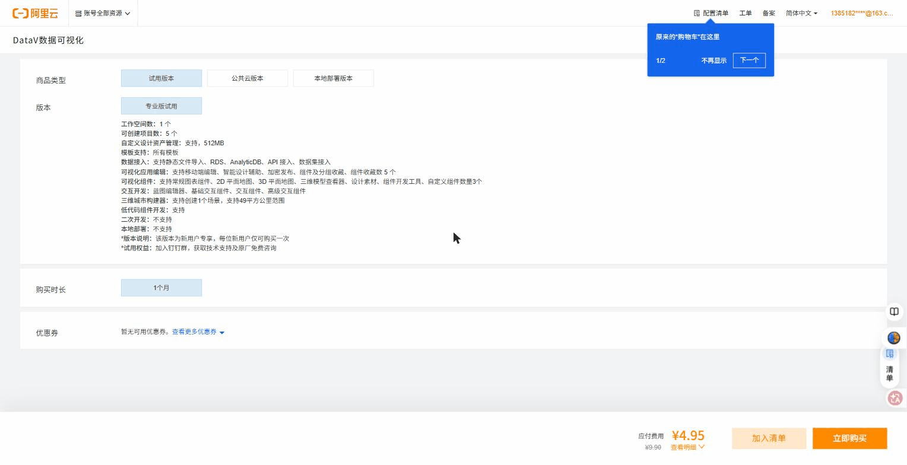
   > △ DataV 数据可视化版本页：列出可视化组件（常规图表、2D/3D 地图、三维城市、交互组件等）——这些就是做"实时下单大屏"用的素材；创建大屏后进编辑器拖组件、连 RDS 数据源即可。
   > 🔗 官方文档：[DataV 产品页](https://www.aliyun.com/product/datav)

### 8.4 学生作业建议

**作业**：用 DataV 给本课程项目做一个"咖啡店实时运营大屏"，包括：
- 今日订单数 / 今日营收（实时刷新）
- 24 小时下单趋势线
- 热销咖啡 Top 5
- 快递状态分布饼图

跑通后录屏，作为期末作品 demo。

---

## Part 9 一张图：8 个工具在项目里的位置

```
                            ┌──────────────────┐
                            │   用户浏览器/App  │
                            └────────┬─────────┘
                                     │ HTTPS
                                     ▼
              ┌──────────────────────────────────────┐
   PTS ──压──►│  前端 SLB + coffee-app（网关）       │◄── ARMS 监控全链路
              └──────────────────┬───────────────────┘
                                 │ Dubbo
              ┌──────────────────┴───────────────────┐
              │                                       │
        ┌─────▼──────┐                       ┌────────▼─────┐
        │ userorder  │◄── ARMS Agent         │ expresstrack │
        └─────┬──────┘    采集               └────────┬─────┘
              │                                       │
              │  JDBC                                 │
              └─────────────┬─────────────────────────┘
                            ▼
                     ┌────────────┐
                     │  RDS MySQL │ ◄── 云监控 看 CPU / 慢 SQL
                     └────┬───────┘
                          │
                          │ 数据源
                          ▼
                  ┌──────────────────────┐
                  │  QuickBI（自助报表）  │
                  │  DataV（大屏汇报）    │
                  └──────────────────────┘

   旁路系统：
   - SLS：收集 3 台 ECS 应用日志 + ActionTrail 操作审计
   - 云监控：监控 ECS / RDS / SLB 基础指标 + 触发钉钉告警
   - EMAS：本项目暂无 APP 端，预留
```

| 上线前 | 上线后日常 | 出事故时 | 业务侧 |
|--------|-----------|---------|--------|
| **PTS** 压测 | **云监控**自动告警 | **ARMS**链路定位 | **QuickBI** 报表 |
| **ARMS** 看链路 | **SLS** 集中日志 | **SLS** 查日志 | **DataV** 大屏 |
|  | **ActionTrail** 操作留痕 |  |  |

---

## 附录 常见问题

**Q：8 个工具都要全部接吗？**

不是。**最小必要集**：云监控 + SLS（这两个是基础设施级的，几乎所有项目都要接）。其他按需：
- 项目上线前接 **PTS + ARMS** 压一次
- 有业务方诉求时接 **QuickBI**
- 有汇报需求时接 **DataV**
- 有移动端时接 **EMAS**

**Q：ARMS Agent 会拖慢应用吗？**

会，但 **通常 < 3%**。生产环境普遍可接受。如果你的应用对延迟极敏感（高频交易类），用 ARMS 的 **eBPF 版**——零侵入采集。

**Q：SLS 存日志贵吗？**

按存储 + 索引计费。教学项目几百 MB 一个月，**月费几块钱**。生产项目要规划日志分级：
- DEBUG/INFO 短期保留（7 天）
- WARN/ERROR 长期保留（90 天 ~ 1 年）
- 审计日志归档到 OSS 冷存储（永久但便宜）

**Q：QuickBI / DataV 二选一怎么选？**

- 数据需要 **交互式探索** → QuickBI
- 数据需要 **酷炫展示** → DataV
- **都要** → 两个都开（共用同一个 RDS 数据源）

**Q：本课程项目上线一般会用哪几个？**

教学版最务实组合：
1. **云监控**（必接，配钉钉告警）
2. **SLS**（必接，废 SSH 看日志）
3. **ARMS**（强烈建议，全链路追踪）
4. PTS 上线前压一次
5. QuickBI 给业务方
6. DataV 答辩时用

---

[← 返回主文档](../README.md) | [上一章：云原生应用的内外访问](08-cloud-network-access.md)
